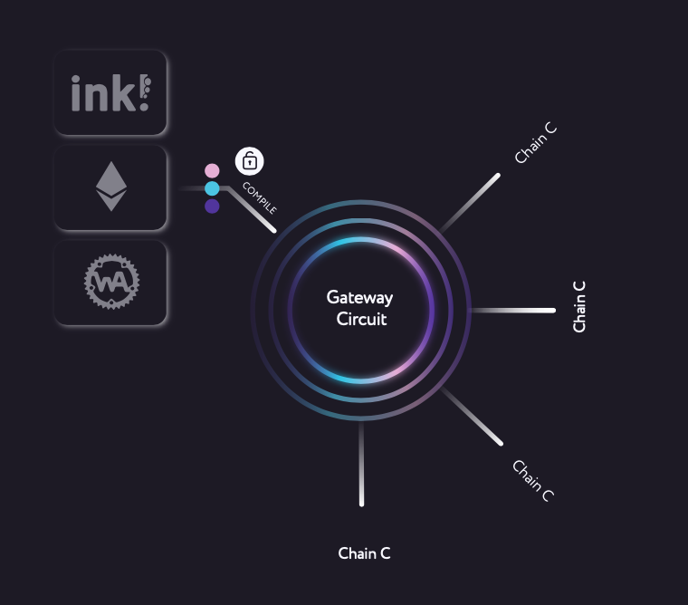

# Welcome to t3rn!

t3rn is a hosting platform for smart contracts, that enables trustless, multi-chain execution and composable collaboration.

t3rn renders smart contracts blockchain agnostic, meaning they can instantly execute on multiple blockchains. The smart contracts can be uploaded as they are and the t3rn protocol will host and execute them across different blockchains, breaking the barrier to serving users across industries and blockchain platforms.

## Interoperability plugin - integrate with Gateway
The protocol works well with Parachains regardless of whether they support smart contracts or not. It's designed to be highly compatible with different blockchain architectures and easy integration using one of three kind of Gateway: Intrinsic Programmable, Extrinsic Programmable or Transaction-Only.

t3rn emphasizes the existent decentralised-solutions and allows multiple blockchains to collaborate on the same contracts repository. By re-using the whole decentralised application blocks, fosters building the decentralised solutions with the freedom to operate on multiple chains.
t3rn facilitates building interoperable solutions in familiar smart contract languages like Solidity, !ink or directly in Web Assembly. Smart contracts or Modules for Runtime which are hosted on a decentralised execution platform, Circuit and can be executed on multiple integrated blockchains. These smart contracts are shared and are being collaboratively added by community. 

[Learn more about Gateways and how to integrate with t3rn.](./gateway)

## Multi-chain execution platform - execute on Circuit
Gateway Cicuit shares the context of the overall Interoperable Transaction and passes it over to the Gateways. The context contains all of the necessary data base on the Parachains can decide whether to not proceed with the execution. 
Gateway Circuit has an access to all of the ongoing Interoperable Transactions and before the execution is started the circuit checks if there is no two transactions changing the same account at the same time. 

[Work on the Circuit Prototype is currently in progress.](./circuit)

## On-chain contracts repository - share composable contracts.

Each successful compilation of Composable Smart Contracts is immediately available for the network to use. 

Think of it as a decentralised package manager created by the community of t3rn developers.

All the newly created code for interoperable programming is automatically shared with other developers to reuse:
•  projects can easily collaborate by sharing and re-using the business logic 
•  developers can contribute code for free or expecting renumeration per usage. This open up a way for developers of earning money for writing the Open Source code.

Smart contracts can be written in familiar languages like !ink, Solidity, WebAssembly. Existent smart contracts can be uploaded as they are, no rewriting required. 

[Learn more about writing comosable contracts in our SDK.](./sdk)

## Motivation

Creating safe solutions operating and synchronizing multiple blockchains comes with the new challenges.

### Unify Standards
Blockchain parameters like block time, finality parameters, proofs of inclusion and execution or account model differ between different blockchains and each platform comes with own original implementation. t3rn offers a way of bringing the common structure and offers the protocol on the above characteristics so that multiple architectures can find a way of reaching the agreement with each other based on the t3rn protocol. 
Also, the implementations of similar blockchain functionalities are mostly re-implemented each time a new blockchain goes live. Transfers, Multisignatures, NFTs are all having very similar API and effects, yet all of the blockchains implement them separately. t3rn comes with the registry of reusable packages, where the exact binaries will be executed against any engaged blockchain.

### Reusable code
Thanks to t3rn a given standard can be implemented once and the same binaries re-used in multiple solutions. That stands in the oposition of the current situation where platform implement the same functionalities in multiple ways - multisignature accounts, NFTs are all having very similar effects yet there is many implementations available.
 Having a single registry of available functionalities with the support of interoperable execution and the list of projects that support them. The more packages there is, the easier it is write new Packages. There is an opportunity to grow fast.
 
### Synchronisation
Multiple blockchains means that accounts and the storage allocated by them is located on different chains. Without the overarching synchronisation mechanism there is no guarantee that the state of accounts won't change while the interoperable transaction is executed. t3rn offers the interoperable execution protocol performed by Gateway Circuit, which menages the multi-chain transactions.

### Non-reversible
Once a transaction is applied on a blockchians it's non-reversible, which constitutes a problem for transactions only considered useful if they succeed on multiple blockchains simultaneously. t3rn introduces multiple phases to execution of interoperable transactions and implements the safety mechanisms which are able to revert the execution on affected chains in case the overall interoperable transaction fails. 

### Complexity
Designing interoperable solutions is complex and requires developers and users to operate on multiple blockchains, possibly creating multiple different accounts, acquiring multiple currencies, providing a way for different blockchains to communicate. t3rn brings that complexity down and offers services and packages that facilitate interoperable transaction securely. t3rn is an easy way to write or just validate the proof of concept code which connects multiple blockchains together. As of now instantiating multiple blockchains, connect them with bridges and write independent smart contracts on each one of them is quite a challenge. t3rn comes with Composable Smart Contracts which can be simply deployed on existent t3rn network, so the setup of blockchains and bridges is not necessary.

## Development Roadmap 
#### Phase 1: [Standalone Gateways & Contracts Compilation SDK](./roadmap/initial_development_phase.md)
#### Phase 2: Live Circuit Prototype
#### Phase 3: Feature-Complete PoA Circuit
#### Phase 4: Trustless PoS Circuit

## License

---
Copyright 2020 Maciej Baj.

Unless required by applicable law or agreed to in writing, software
distributed under the License is distributed on an "AS IS" BASIS,
WITHOUT WARRANTIES OR CONDITIONS OF ANY KIND, either express or implied.
See the License for the specific language governing permissions and
limitations under the License.

Licensed under the Apache License, Version 2.0 (the "License");
you may not use this file except in compliance with the License.
You may obtain a copy of the License at

    http://www.apache.org/licenses/LICENSE-2.0

---
