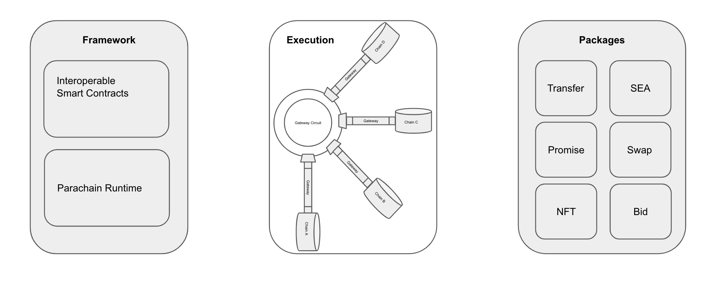
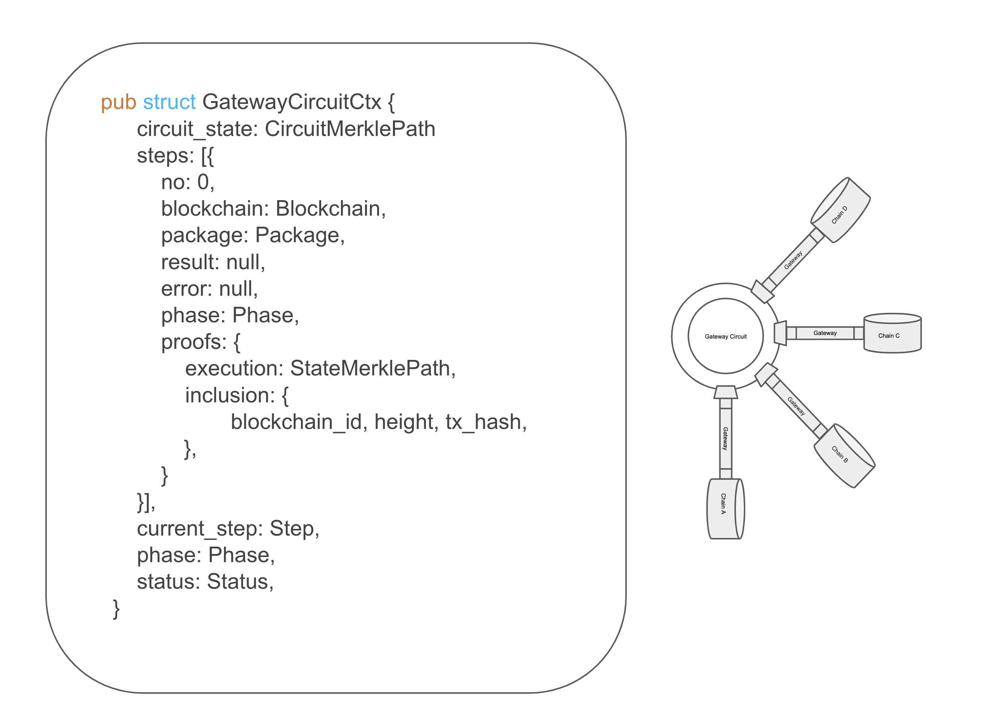
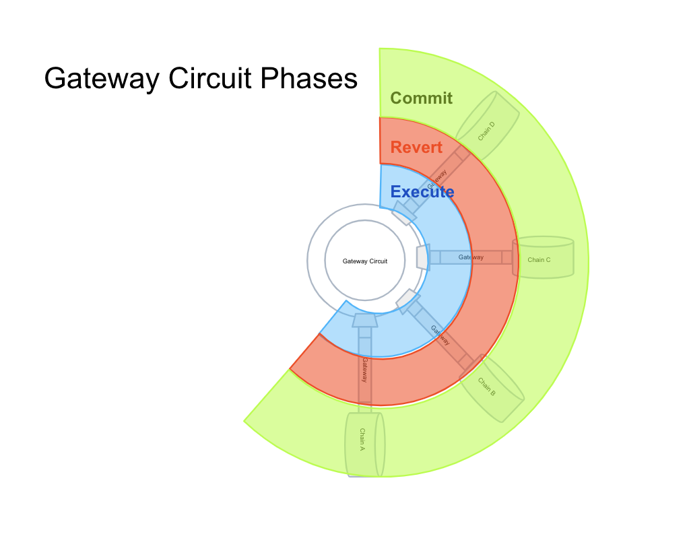

# Welcome to t3rn!

t3rn is a protocol for interoperable code execution between multiple blockchains, which makes it safe and simple.
t3rn consists out of framework & tools to write interoperable code (both as contracts and runtime logic), the execution platform of that code and reusable packages registry - blocks of interoperable logic maintained by decentralised network.



t3rn facilitates building interoperable solutions in Rust, providing an easy way of writing new Interoperable Contracts or Modules for Runtime, by re-using binaries which are shared and collaboratively added by all of the participants of the decentralised network. The protocol works well with Parachains regardless of whether they support smart contracts or not.

t3rn emphasizes the existent decentralised-solutions interoperability and allows multiple blockchains to collaborate. By re-using the whole decentralised application blocks, fosters building the decentralised solutions with the freedom to operate on multiple chains.

An arctic tern is a little bird yet flies over the whole globe and visits most of the continents. 

# Motivation

Creating safe solutions operating and synchronizing multiple blockchains comes with the new challenges.

### Unify Standards
Blockchain parameters like block time, finality parameters, proofs of inclusion and execution or account model differ between different blockchains and each platform comes with own original implementation. t3rn offers a way of bringing the common structure and offers the protocol on the above characteristics so that multiple architectures can find a way of reaching the agreement with each other based on the t3rn protocol. 
Also, the implementations of similar blockchain functionalities are mostly re-implemented each time a new blockchain goes live. Transfers, Multisignatures, NFTs are all having very similar API and effects, yet all of the blockchains implement them separately. t3rn comes with the registry of reusable packages, where the exact binaries will be executed against any engaged blockchain.

### Reusable code
Thanks to t3rn a given standard can be implemented once and the same binaries re-used in multiple solutions. That stands in the oposition of the current situation where platform implement the same functionalities in multiple ways - multisignature accounts, NFTs are all having very similar effects yet there is many implementations available.
 Having a single registry of available functionalities with the support of interoperable execution and the list of projects that support them. The more packages there is, the easier it is write new Packages. There is an opportunity to grow fast.
 
### Synchronisation
Multiple blockchains means that accounts and the storage allocated by them is located on different chains. Without the overarching synchronisation mechanism there is no guarantee that the state of accounts won't change while the interoperable transaction is executed. t3rn offers the interoperable execution protocol performed by Gateway Circuit, which menages the multi-chain transactions.

### Non-reversible
Once a transaction is applied on a blockchians it's non-reversible, which constitutes a problem for transactions only considered useful if they succeed on multiple blockchains simultaneously. t3rn introduces multiple phases to execution of interoperable transactions and implements the safety mechanisms which are able to revert the execution on affected chains in case the overall interoperable transaction fails. 

### Complexity
Designing interoperable solutions is complex and requires developers and users to operate on multiple blockchains, possibly creating multiple different accounts, acquiring multiple currencies, providing a way for different blockchains to communicate. t3rn brings that complexity down and offers services and packages that facilitate interoperable transaction securely. t3rn is an easy way to write or just validate the proof of concept code which connects multiple blockchains together. As of now instantiating multiple blockchains, connect them with bridges and write independent smart contracts on each one of them is quite a challenge. t3rn comes with Interoperable Smart Contracts which can be simply deployed on existent t3rn network, so the setup of blockchains and bridges is not necessary.

# Overview

Packages (either Interoperable Smart Contract or Interoperable logic of Runtime Module) are the main actor of t3rn system. This is where the interoperable logic is being written by developers. Packages must be compiled to the binary form which includes the metadata which makes them usable to t3rn network, running the Gateway Circuit module.

Framework for packages comes with the compiler which translates packages to binaries + metadata and tooling sending them to the network API service.

On the other side of the packages, there is always an end-user - someone who uses the contract or provided by Runtime Module service, usually via some kind of web or desktop client. End-user isn't directly involved as an actor of t3rn use cases, but the system is designed keeping the user's best interest in place by introducing the protocol over how the interoperable transaction gets executed and gives a way to revert the effects of the transactions, despite multiple blockchains being involved. That's the main job of Gateways Circuit, that controls the execution of an interoperable piece of logic over multiple blockchains via Gateways, shares the current state of an interoperable transaction with interested parties and proofs the execution and inclusion on all affected Parachains. Developers can control the execution order of each step of the Gateway Circuit by implementing the promise-like behaviours to their contracts. That's revealed in more detail in the Gateway Standards description and a few examples.

Gateway is responsible for executing the logic and metadata provided in incoming from the Gateway Circuit message in a context of connecting Parachain.
 
 


# Offering

## Framework for Interoperable Packages

t3rn gives developers a simple way to write Interoperable Contracts and Modules which are executed on multiple blockchains.
  Design of Packages puts the emphasis on convenient programming for multiple blockchains. Makes it easy to write and quickly prototype interoperable solutions which are deployed and executed against t3rn network, which that in turn knows how to execute it against the connected blockchains.
  
### Initial Packages
t3rn as a project is as useful as the resources of packages & contracts available to Developers. With the initial realease t3rn comes with the most useful packages that make developing following ones way easier.

##### transfers
For making the balance transfers way easier between the Parachains. 

###### manual

Manual transfers need to be (manually) facilitated in modules / contracts or by users, without the interference of t3rn validators via escrow accounts. Manual balance transfers need to be cryptographically sound on a pointed by transaction Parachain, therefore as an argument accept a signature. By default a signature is derived during the package compilation out of the callers secret. 

- `manual(from: AccountId, to: AccountId, value: BalanceOf, signature: Option<&[u8]>)` - moves funds between accounts providing a signature. 

A simple exchange between two accounts of different chains can be facilitated using manual transfers: 

```rust
// Let's assume that both receiver and sender have the same addresses on both chains A and B.

fn exchange_A_for_B_with_ratio_10x (&self, receiver: AccountId, receiver_signature: &[u8]) {
    let sender = self.env().caller();
    ChainA::transfer::manual(from=sender, to=receiver, 100);
    ChainB::transfer::manual(from=receiver, to=sender, 1000, receiver_signature);
}
```
``
A side note to the example:
As the t3rn protocol introduces the Circuit with multiple execution phases, adding any sort of additional temporarily fund locks isn't needed here to provide the secure exchange between the sender and receiver. In case if the transfer execution fails on any of ChainA or ChainB due to lack of funds by either sender or receiver, the temporary effects added to the escrow accounts will be invalidated and balance will not be deducted out of neither sender nor receiver.
``
###### auto
Auto stands for the automatic transfers, meaning that the t3rn validators facilitate the necessary trades under hood with the best interest of the the buyer, based on the current exchange rate between the trading pair. 

In essence, the auto transfer moves the funds between the escrow account on a given chain (authorised only for the t3rn Circuit access) and a buyer account. 

The auto package shifts a lot of responsibility on the t3rn validators as at the end they need to ensure enough liquidity on the escrow accounts. The protocol leaves the decision of whether to execute an auto transfer or not to validators. Aid for the possible compromise of interests for validators, connected with the value fluctuation of Parachains affecting the holdings of escrow accounts, comes with using 3rd party exchanges to facilitate the exchange of funds on the go. By doing so, the validators wouldn't have to ensure the liquidity of the escrow accounts themselves anymore.  

- `auto(to: AccountId, value: BalanceOf, rate: Option<Rate>)` - leave the responsibility to facilitate the balance transfer to the pointed account to t3rn validators. An optional argument specifies the lowest exchange rate after which the transaction fails.
- `exchange(pair: TradingPair, seller: AccountId, buyer: AccountId, value: BalanceOf, rate: Rate)` - exchange a trading pair using a 3rd party exchange. The external services would have to be integrated.
- `rates(pair: TradingPair) -> BlockNumber` - package that retrieves the current exchange rates between the pairs. The rates package is used by the validators to agree on the amount of balance transfers between the escrow and buyer accounts on a given chain.

```rust
fn simply_transfer_money_to_some_chains (&self, receiver: AccountId) {
    ChainA::transfer::auto(to=receiver, 100);
    ChainB::transfer::auto(to=receiver, 200);
}
```

###### swap

This kind of transfers swaps the balances between two different accounts of two different chains by using the atomic swap mechanism. To facilitate the swaps and create the necessary infrastructure able to store the swap orders and match them with compounding swap agreements additional modules are created and hosted by the t3rn network.

- `swap(dest: Chain, amount: BalanceOf, seller: Option<AccountId>, limit: Option<Rate>, timeout: Option<Timeout>)`- posts the swap order of a given amount for best available ratio out of the existing orders (risky for pairs with low liquidity). 
    - `seller` account needs to be cryptographically sound on the source chain as underneath the market package moves the funds to the escrow account on that chain. By default seller and the funds receiver is the Contract caller of whom the signature is derived while signing the package execution.
    - `limit` is an optional parameter specifying the exchange rate between the pair. By default it swaps compounds the best available swap offers that are already posted (works like "market" on Kraken). 
    - `timeout` optional timeout after the swap offer gets cancelled. By default a swap offer doesn't expire. All swaps can be cancelled by calling `x::swap:cancel(my_swap)`.
    
- `cancel(swap: Swap)`- cancels the previously commited swaps. 

Some examples of using the swap package:

```rust
fn swap_A_for_B_best_offers (&self) {
    ChainA::transfer::swap(dest=ChainB, 100);
}

fn swap_A_for_B_current_price_diff_accounts (&self, different_receiver: AccountId) {
    ChainA::transfer::swap(dest=ChainB, 100, seller=different_receiver);
}

fn swap_A_for_B_limit_price (&self, limit: Rate) {
    ChainA::transfer::swap(dest=ChainB, 100, null, limit);
}
```

#### One Contract, multiple blockchains, no setup 

t3rn implements the execution environemnt for Interoperable Smart Contracts, therefore no installation of execution environment for ISC needed!
ISC Developers need to only sign and send their contracts to the network, t3rn deploys and executes the ISC over integrated blockchain which is overseen by the Gateways Circuit.
It's safe and transparent - developers and users can verify the proofs of each execution step.
    
    
#### Network - Maintain, Govern, Secure

Gateway Circuit is operated by the t3rn network and operators and validators. t3rn network powered by t3rn token which is used to facilitate interoperable transactions, secure and govern the packages in the registry.
Network has following tasks:
- Charging fees for the interoperable execution if specified so by the operators of parachain nodes.
- Provide the automatic conversion of cryptocurrencies of supported blockchains to t3rn token to guarantee the seamless execution of ISC or ensure the liquidity of escrow accounts on connected Parachains. 
- Provides a platfrom for Interoperable Smart Contracts to execute and ensures the trustless execution of the business logic of ISCs and Runtime Modules between multiple chains following the protocol of the Gateway Circuit.
        - Forms the consensus over the provided by Gateways proofs in order to bring the security over the results of interoperable execution.
        - Stores and provides the results of execution of the Gateway Circuit.


#### CLI & Compiler
On top of the SRML module there are Rust libraries that enable developers to write either Interoperable Smart Contracts or SRML using t3rn framework. 
These contains also examples of both ISCs and SRML using t3rn as well as a CLI.

Communicates with API of t3rn SRML and compiles contracts and modules into the WASM Binaries + Metadata for Circuit format.

- Reload

Reloads the set of available modules and makes all of the successfully compiled ISCs immediately available for import.
`t3rn reload`

- New

Creates new interoperable smart contracts and preloads it if necessary imports.  

`t3rn new my_isc.rs`

You can also use it to link the modules you need:

`t3rn new my_sc.rs --modules erc20,promises`

- Setup local environment

Sets up the local network locally. Runs substrate with t3rn contracts on your local machine.

`t3rn setup_local`
- Exec

Executes the contract against the ISC network.  

`t3rn exec my_isc.rs --test/local/production`

### Partnerships

The technology and integration of the next projects and initiatives will be relying on the needs of Strategic Partnerships of Tern. 

There can be several roles of partnerships in the Tern network:

#### Strategic Partners
Projects and initiatives Tern would like to include into the network because of the high value they could provide to the ecosystem. 

#### Building Partners
Projects and initiatives that contribute to development, integration of next services or write the additional ISCs to enhance the usability of Tern framework. 
Potential partners: Tern Team, open-source developers, development teams

#### Technology Partners
Projects and initiatives on of which services/platforms Tern network relies.  
Potential partners: Polkadot, Komodo.

## Parachains Support

t3rn can be easily integrated into exising and new Parachains. There is a dedicated Gateway Pallet to do so, modelled to be very similar to Contracts Pallet, therefore giving the same developer experience and functionalities while creating t3rn Contracts. Gateway Circuit oversees, synchronises and secures the interoperable execution between Parachains involved. 

## Gateway Circuit

Gateway Cicuit shares the context of the overall Interoperable Transaction and passes it over to the Gateways. The context contains all of the necessary data base on the Parachains can decide whether to not proceed with the execution. 
Gateway Circuit has an access to all of the ongoing Interoperable Transactions and before the execution is started the circuit checks if there is no two transactions changing the same account at the same time. 


Circuit has several phases, in each phase all Gateways all prompted for the corresponding actions:
- `Execution` - Execute the Packages on all of the Gateways (either by attaching the binaries or by invoking the execution on a source Parachain). Execution phase finishes after receiving the return message from each Gateway, which includes the execution results and proofs of execution and inclusion on a given Parachain. Circuit verifies those proofs. During that verification Circuit constructs the  `deffered` changes trie, which is stored in the execution context of the entire interoperable transaction and on which Packages can rely on to determine whether the execution of should or should not happen. There is an example, which shows how the execution on one chain checks whether the deposits have been placed in other currencies on their Parachains.  
- `Revert` - Optional and the last phase, triggered when the execution fails on one of the Gateways or cannot be proved by Circuit during Execution phase. During that phase on each Gateway the changes added to escrow accounts are removed and changes to the accounts pointed in contracts will never be commited.
- `Commit` - Optional and the last phase, triggered after the Execution phase is succesfully concluded on all of the Gateway and proved by Circuit. During commit changes on each Parachain are commited to the permanent accounts pointed in contracts. After the commit phase changes can no longer be reverted. 




```rust
impl GatewayCircuit {
    
    fn new (&self, tx: Transaction) {
        self.ctx = GatewayCircuitCtx(tx);
        if (lock_accounts_conflict()) {
            finalize(AccountsConflict);
        } else {
            lock_accounts();
        }   
    }
    
    fn on_step_response (&self, step: Step) {
        if (step.error || !verify_proof(step)) {
            self.ctx.status = Status(Status.REVERT, step);
        } 
        step.phase += 1;
        if (all_steps_processed()) {
            next_phase();
        }
    }
    
    fn next_phase (&self) {
        if (last_phase()) {
           finalize();
        }
        else {  
            for step in get_next_steps_by_order(self.ctx.steps) {
               step.blockchain.gateway.send(ctx.serialize());    
               step.blockchain.gateway.on_response(on_step_response(step));
               current_step = step;
            }
        }       
    }
    
    fn finalize(&self) {
       charge_fees();
       unlock_accounts();
       send_back_results();
    }
}
```

### Decentralised Package Manager

Each successful compilation of Interoperable Smart Contracts is immediately available for the network to use. 

Think of it as a decentralised package manager created by the community of t3rn developers.

All the newly created code for interoperable programming is automatically shared with other developers to reuse:
•  projects can easily collaborate by sharing and re-using the business logic 
•  developers can define new ISC interfaces and create the option of defining fees for using their code. This open up a new and immediately executed way for developers of earning money for writing the Open Source code.

#### Standards unification 
New standards and interfaces linking the blockchains working in similar domains are clustered into modules and hosted by the decentralised network, providing rich interoperability between them. Projects working on similar objectives, e.g. Data Decentralisation can now build the standards of data exchange together and share the services with each other.

#### Registry
Provides ways of registering new blockchains, standards, gateways and packages to t3rn.

Registry is responsible for generating the new contracts for each blockchain (using [instantiate](https://substrate.dev/rustdocs/master/pallet_contracts/enum.Call.html#variant.instantiate)) on t3rn network. Each blockchain has then its own wrapper around all of the available modules, which are accessible from other t3rn packages. That blockchain-specific data is versioned and can be updated as the support for new modules is added.


##### New Blockchains
During the registration one needs to specify with which t3rn components does the blockchain support. 
- Select the features out of the modules that can be executed on the blockchain from other parachains and ISCs (transfers, blockchain event handlers). 
- Select Gateway between the blockchain with t3rn.

Registration of new blockchains usually happens if a Runtime Module owner decides to create new packages available in that module or simply wants to provide the access to standard t3rn features.
Parachain needs to implement a handler for the selected gateway. For example while selecting the XCMP Gateway, a parachain needs to implement the Gateway's API while handling the XCMP incoming messages. 

There can be several ways of registering new blockchains. It can be done either in ISC/Runtime Module by filling the register macro or by posting to the HTTP/RPC API submodule of tern. Let's use a macro as an example:

```rust
    #[t3rn::register::chain::new('FlipperChain', t3rn::gateway::xcmp, t3rn::modules::support::{Flipper}, version = "0.0.0")]
```

## [Gateway](https://github.com/t3rn/t3rn/blob/development/gateway/README.md)
#### Gateway executing packages in the context of a single parachain with multiple phases is the result of the initial development phase of t3rn interoperable protocol, therefore described in a separate document._

## Development Roadmap 
#### Phases 1: [Initial Development Phase - Standalone Gateway & Packages Compilation](./roadmap/initial_development_phase.md)
#### Following Phases 2-4: [Following Development Phases - Gateway Circuit, Registry, Trustfree Execution, Additional Packages](./roadmap/following_development_phases.md)


## License

---
Copyright 2020 Maciej Baj.

Licensed under the Apache License, Version 2.0 (the "License");
you may not use this file except in compliance with the License.
You may obtain a copy of the License at

    http://www.apache.org/licenses/LICENSE-2.0

Unless required by applicable law or agreed to in writing, software
distributed under the License is distributed on an "AS IS" BASIS,
WITHOUT WARRANTIES OR CONDITIONS OF ANY KIND, either express or implied.
See the License for the specific language governing permissions and
limitations under the License.
---
