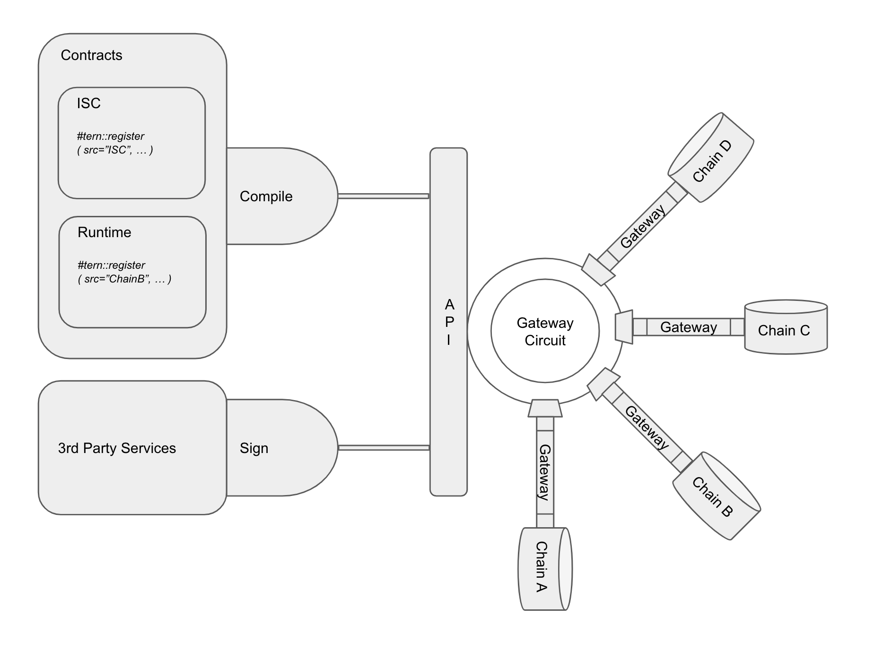
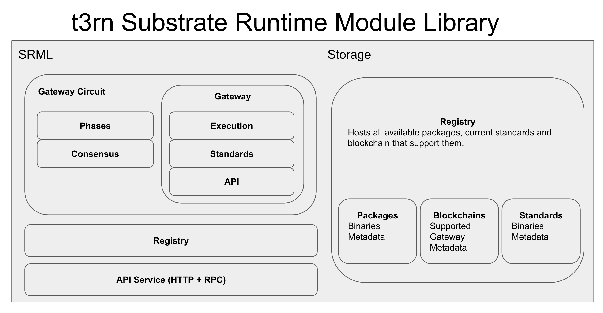

# Welcome to t3rn!

t3rn is a protocol for interoperable code execution between multiple blockchains, which makes it safe and simple.
t3rn consists out of framework & tools to write interoperable code (both as contracts and runtime logic), the execution platform of that code and reusable packages registry - blocks of interoperable logic maintained by decentralised network.


t3rn facilitates building interoperable solutions in Rust, providing an easy way of writing new Interoperable Contracts or Modules for Runtime, by re-using binaries which are shared and collaboratively added by all of the participants of the decentralised network. The protocol works well with Parachains regardless of whether they support smart contracts or not.

t3rn emphasizes the existent decentralised-solutions interoperability and allows multiple blockchains to collaborate. By re-using the whole decentralised application blocks, fosters building the decentralised solutions with the freedom to operate on multiple chains.

An arctic tern is a little bird yet flies over the whole globe and visits most of the continents. 

# Motivation

Creating safe solutions operating and synchronizing multiple blockchains comes with the new challenges.

### Unify Standards
Blockchain parameters like block time, finality parameters, proofs of inclusion and execution or account model differ between different blockchains and each platform comes with own original implementation. t3rn offers a way of bringing the common structure and offers the protocol on the above characteristics so that multiple architectures can find a way of reaching the agreement with each other based on the t3rn protocol. 
Also, the implementations of similar blockchain functionalities are mostly re-implemented each time a new blockchain goes live. Transfers, Multisignatures, NFTs are all having very similar API and effects, yet all of the blockchains implement them separately. t3rn comes with the registry of reusable packages, where the exact binaries will be executed against any engaged blockchain.

### Reusable code
Thanks to t3rn a given standard can be implemented once and the same binaries re-used in multiple solutions. That stands in the oposition of the current situation where platform implement the same functionalities in multiple ways - multisignature accounts, NFTs are all having very similar effects yet there is many implementations available.
 Having a single registry of available functionalities with the support of interoperable execution and the list of projects that support them. The more packages there is, the easier it is write new Packages. There is an opportunity to grow fast.
 
### Synchronisation
Multiple blockchains means that accounts and the storage allocated by them is located on different chains. Without the overarching synchronisation mechanism there is no guarantee that the state of accounts won't change while the interoperable transaction is executed. t3rn offers the interoperable execution protocol performed by Gateway Circuit, which menages the multi-chain transactions.

### Non-reversible
Once a transaction is applied on a blockchians it's non-reversible, which constitutes a problem for transactions only considered useful if they succeed on multiple blockchains simultaneously. t3rn introduces multiple phases to execution of interoperable transactions and implements the safety mechanisms which are able to revert the execution on affected chains in case the overall interoperable transaction fails. 

### Complexity
Designing interoperable solutions is complex and requires developers and users to operate on multiple blockchains, possibly creating multiple different accounts, acquiring multiple currencies, providing a way for different blockchains to communicate. t3rn brings that complexity down and offers services and packages that facilitate interoperable transaction securely. t3rn is an easy way to write or just validate the proof of concept code which connects multiple blockchains together. As of now instantiating multiple blockchains, connect them with bridges and write independent smart contracts on each one of them is quite a challenge. t3rn comes with Interoperable Smart Contracts which can be simply deployed on existent t3rn network, so the setup of blockchains and bridges is not necessary.

# Overview

Packages (either Interoperable Smart Contract or Interoperable logic of Runtime Module) are the main actor of t3rn system. This is where the interoperable logic is being written by developers. Packages must be compiled to the binary form which includes the metadata which makes them usable to t3rn network, running the Gateway Circuit module.

Framework for packages comes with the compiler which translates packages to binaries + metadata and tooling sending them to the network API service.

On the other side of the packages, there is always an end-user - someone who uses the contract or provided by Runtime Module service, usually via some kind of web or desktop client. End-user isn't directly involved as an actor of t3rn use cases, but the system is designed keeping the user's best interest in place by introducing the protocol over how the interoperable transaction gets executed and gives a way to revert the effects of the transactions, despite multiple blockchains being involved. That's the main job of Gateways Circuit, that controls the execution of an interoperable piece of logic over multiple blockchains via Gateways, shares the current state of an interoperable transaction with interested parties and proofs the execution and inclusion on all affected Parachains. Developers can control the execution order of each step of the Gateway Circuit by implementing the promise-like behaviours to their contracts. That's revealed in more detail in the Gateway Standards description and a few examples.

Gateway is responsible for executing the logic and metadata provided in incoming from the Gateway Circuit message in a context of connecting Parachain.
 
 


# Offering

## Framework for Interoperable Packages

t3rn gives developers a simple way to write Interoperable Contracts and Modules which are executed on multiple blockchains.
  Design of Packages  puts the emphasis on convenient programming for multiple blockchains. Makes it easy to write and quickly prototype interoperable solutions which are deployed and executed against t3rn network, which that in turn knows how to execute it against the connected blockchains.
  
### Package, Contract, Module

In this document a package stands for either a module or a contract (or multiple modules and/or contracts introducing a related functionality). Most of the time the a package, module or contract is mentioned it is used as a t3rn-specific one, intended to work specifically in the interoperable context. Most of the time "package" means "module or contract". 

Modules and contracts consists out of the interface description (input and output) and binaries (WASM Binaries with optional no binaries for private module) and can share a source code.
  
To summarize, module in contrary to contract can set additional `source` (a parachain) and `private` parameters. 

#### Register new Packages

The easiest way to register new packages is to write an ISC - Interoperable Smart Contract. As all ISC are hosted by t3rn network all of the ISC packages are automatically available for other developers to use. The registry oversees all of the packages and contains the extra metadata interesting for developers.  

During the registration of a package, developers can specify multiple additional parameters like an execution cost. The fees from execution of a given functions will be transferred to its creator. That's interesting, it opens up a new way for developers of earning money for writing Open Source code.

t3rn comes the compilers for packages that work in similar vain as the compiler of !Ink contracts. The compiler translates the contract or module into the WASM Binaries and attaches necessary metadata required by Gateway Circuit.

```
// Register a free of charge contract. Alleged for contracts: `source=*`, `private=false`. Default for contracts `access=free`, `owner=signer`.

#[tern::contract(owner=tern::owner:signer, access=tern::access:free, version = "0.1.0")]
mod my_contract { ... }

// Register a package which can only be executed on MyChain and costs 1000. 
#[tern::module(owner=tern::owner:AccountId("0x123"), access=tern::access:costs(1000), private=false, source=tern::MyChain, version = "0.1.0")]
mod my_package { ... }
```

Packages consist out of binaries and the interface description (input and output). Moreover each package and contract has several attribute controlling the access:

- `package::source: Parachain` - by default it's set as `*`, meaning that the package can be executed on any Parachain. 
- `package::domain: &[u8]` - domain, that makes it easier cluster the business logic provided by the package into the interoperable standards.
- `package::private: bool` - `false` by default, indicates whether to share the binaries with the network or not. If set to `true` Circuit cannot verify the package's results. Contracts cannot be private as the binaries need to be known for the execution.
- `owner: AccountId` - by default it's the package signer. Account that owns the package, which:
    - is set in the `self.address()` context
    - covers the execution costs of the package and all of the outgoing calls out of that package,
    - can be set to other Account than a signer, which should be helpful for accounts being services, which only charge t
- `access: Access` - access to package which can have multiple forms: 
    - `free` -  package execution is free of charge
    - `costs` - other packages need to pay for the execution, the execution costs will be transferred to the package owner.
    - `subscription` - only accounts with active subscription have access to that package.
    
While developing a contract developers should be aware of the t3rn Circuit Execution protocol introducing multiple execution phases, as from the Circuit Context packages may use necessary information.     
While developing a private package, developers need do be aware of the different execution phases. Creating new private package is no different than creating a new Standard for the Gateway connecting a given Parachain.

The following example showcases both of the mentioned examples - uses deposits and registers private package:

```Rust

    #[tern::contract(access=tern::access:free, owner=AccountId(b"0xhouse_chain_owner_addr") private=true, version = "0.1.0")]
    fn buy_house(&self) {
        Promise.all((
            WoodChain::transfer::auto(to=self.env().self_account(), value=100),
            StoneChain::transfer::auto(to=self.env().self_account(), value=50),
        )).then(|_| {
            HouseChain::build_house(buyer=self.env().caller());
        });
       
    }
    #[tern::module(private=true, source=tern::HouseChain, version = "0.1.0")]
    fn build_house (&self, buyer: AccountId) {
        match self.ctx.step {
            "exec" => {
                // Check if the deposit in Wood and Stone was made for a house. Two ways of doing it:
                // 1. Manually ensure (call get_deffered_tx) out the the Circuit Context 
                // 2. Include the automatic check on the Circuit by specifying the access macro:
                //  "access=tern::access:costs(Vec<(100, t3rn::WoodChain), (50, t3rn::StoneChain)>)"
                let deffered_wood_tx = get_deffered_tx(self.env().account(), Parachain::WoodChain, ctx);
                let deffered_stone_tx = get_deffered_tx(self.env().account(), Parachain::WoodChain, ctx);
                if (deffered_wood_tx.value == 100 && deffered_stone_tx.value == 50) {
                    return Error("Not enough resources provided for a house");
                }
                
               // Build a house for a caller, the secret recipe for building a house remains hidden.
               let house = build_house(self.env().caller);                
               // Store the house in Runtime's own memory - 
               Houses.put(b"house_for_" + self.env().caller, house);
               // As a result return a hash, that may convince a user that the house is built.
               house.encode_and_hash();
            },
            "revert" => {
               // Store the house in Runtime's own memory
               Houses.remove(b"house_for_" + self.env().caller);
            },
            "commit" => {
               Houses.remove(b"house_for_" + self.env().caller);
            }
        }
    }
```

All packages and contracts are stored and maintained by the t3rn network through Registry. Developers have access to all of the packages and Registry should provide the additional information about the package support and current usage statistics.  

Ideally, registered packages and contracts bring clear value to the blockchains interoperability, convincing enough for other Developers to include them in their packages.

#### Accounts Context
Smart Contracts in a domain of a single chain charge the contract's caller for the execution of the logic and the storage used and assigned to that account.

##### Escrow Accounts
 In interoperable execution accounts and contracts are located on different chains, therefore a caller willing to invoke two smart contracts on different chains needs to setup two different accounts, call the contracts individually and pay for the execution in two currencies. t3rn aims to solve that complexity by introducing the escrow accounts registered on each connected Parachain which can control the access to balances and any other storage resource after receiving an authorised order from Circuit. The escrow account is not controlled by any third party and operates solely on the base of its preprogrammed logic. This comes with several advantages:
     - escrow accounts are just accounts like any other and if a contract is attached to it they are charged for the code execution following the requirements of either Balance or Contracts Pallet (the escrow accounts are visible as a caller for Parachains Contracts). Escrow accounts need to be pre-paid by t3rn validators in order to be functioning (major drawback). In exchange the escrow accounts share the billing information with the Circuit, which is able to convert and aggregate the fees from multiple parachain and charge the Interoperable Contract caller who needs to have only one account set up and is charged in one currency only at the end of execution.
    - Any change to escrow account can be invalidated as specified by t3rn protocol different execution phases.
    - Execution proofs can be easily computed out of the changes to escrow accounts.
The drawback of introducing escrow accounts is the additional implementation and maintenance complexity as the validators need to ensure the enough liquidity on all Parachains they support to afford the packages execution.  

The context of Interoperable contracts and packages is slightly more complicated: 

`escrow_account` - owned by the validators is available in the context of contracts and packages.

`self_account` - the Account of a the package/contract owner.  

`caller` - it's a t3rn Account of the initial caller of the first package/contract, which covers all of the costs aggregated from multiple potential execution on multiple Parachains. The context of the caller is propagated to all of the Gateways by Circuit.

### Initial Packages
t3rn as a project is as useful as the resources of packages & contracts available to Developers. With the initial realease t3rn comes with the most useful packages that make developing following ones way easier.

##### transfers
For making the balance transfers way easier between the Parachains. 

###### manual

Manual transfers need to be (manually) facilitated in modules / contracts or by users, without the interference of t3rn validators via escrow accounts. Manual balance transfers need to be cryptographically sound on a pointed by transaction Parachain, therefore as an argument accept a signature. By default a signature is derived during the package compilation out of the callers secret. 

- `manual(from: AccountId, to: AccountId, value: BalanceOf, signature: Option<&[u8]>)` - moves funds between accounts providing a signature. 

A simple exchange between two accounts of different chains can be facilitated using manual transfers: 

```rust
// Let's assume that both receiver and sender have the same addresses on both chains A and B.

fn exchange_A_for_B_with_ratio_10x (&self, receiver: AccountId, receiver_signature: &[u8]) {
    let sender = self.env().caller();
    ChainA::transfer::manual(from=sender, to=receiver, 100);
    ChainB::transfer::manual(from=receiver, to=sender, 1000, receiver_signature);
}
```
``
A side note to the example:
As the t3rn protocol introduces the Circuit with multiple execution phases, adding any sort of additional temporarily fund locks isn't needed here to provide the secure exchange between the sender and receiver. In case if the transfer execution fails on any of ChainA or ChainB due to lack of funds by either sender or receiver, the temporary effects added to the escrow accounts will be invalidated and balance will not be deducted out of neither sender nor receiver.
``
###### auto
Auto stands for the automatic transfers, meaning that the t3rn validators facilitate the necessary trades under hood with the best interest of the the buyer, based on the current exchange rate between the trading pair. 

In essence, the auto transfer moves the funds between the escrow account on a given chain (authorised only for the t3rn Circuit access) and a buyer account. 

The auto package shifts a lot of responsibility on the t3rn validators as at the end they need to ensure enough liquidity on the escrow accounts. The protocol leaves the decision of whether to execute an auto transfer or not to validators. Aid for the possible compromise of interests for validators, connected with the value fluctuation of Parachains affecting the holdings of escrow accounts, comes with using 3rd party exchanges to facilitate the exchange of funds on the go. By doing so, the validators wouldn't have to ensure the liquidity of the escrow accounts themselves anymore.  

- `auto(to: AccountId, value: BalanceOf, rate: Option<Rate>)` - leave the responsibility to facilitate the balance transfer to the pointed account to t3rn validators. An optional argument specifies the lowest exchange rate after which the transaction fails.
- `exchange(pair: TradingPair, seller: AccountId, buyer: AccountId, value: BalanceOf, rate: Rate)` - exchange a trading pair using a 3rd party exchange. The external services would have to be integrated.
- `rates(pair: TradingPair) -> BlockNumber` - package that retrieves the current exchange rates between the pairs. The rates package is used by the validators to agree on the amount of balance transfers between the escrow and buyer accounts on a given chain.

```rust
fn simply_transfer_money_to_some_chains (&self, receiver: AccountId) {
    ChainA::transfer::auto(to=receiver, 100);
    ChainB::transfer::auto(to=receiver, 200);
}
```

###### swap

This kind of transfers swaps the balances between two different accounts of two different chains by using the atomic swap mechanism. To facilitate the swaps and create the necessary infrastructure able to store the swap orders and match them with compounding swap agreements additional modules are created and hosted by the t3rn network.

- `swap(dest: Chain, amount: BalanceOf, seller: Option<AccountId>, limit: Option<Rate>, timeout: Option<Timeout>)`- posts the swap order of a given amount for best available ratio out of the existing orders (risky for pairs with low liquidity). 
    - `seller` account needs to be cryptographically sound on the source chain as underneath the market package moves the funds to the escrow account on that chain. By default seller and the funds receiver is the Contract caller of whom the signature is derived while signing the package execution.
    - `limit` is an optional parameter specifying the exchange rate between the pair. By default it swaps compounds the best available swap offers that are already posted (works like "market" on Kraken). 
    - `timeout` optional timeout after the swap offer gets cancelled. By default a swap offer doesn't expire. All swaps can be cancelled by calling `x::swap:cancel(my_swap)`.
    
- `cancel(swap: Swap)`- cancels the previously commited swaps. 

Some examples of using the swap package:

```rust
fn swap_A_for_B_best_offers (&self) {
    ChainA::transfer::swap(dest=ChainB, 100);
}

fn swap_A_for_B_current_price_diff_accounts (&self, different_receiver: AccountId) {
    ChainA::transfer::swap(dest=ChainB, 100, seller=different_receiver);
}

fn swap_A_for_B_limit_price (&self, limit: Rate) {
    ChainA::transfer::swap(dest=ChainB, 100, null, limit);
}
```

#### One Contract, multiple blockchains, no setup 

t3rn implements the execution environemnt for Interoperable Smart Contracts, therefore no installation of execution environment for ISC needed!
ISC Developers need to only sign and send their contracts to the network, t3rn deploys and executes the ISC over integrated blockchain which is overseen by the Gateways Circuit.
It's safe and transparent - developers and users can verify the proofs of each execution step.
    
    
#### Network - Maintain, Govern, Secure

Gateway Circuit is operated by the t3rn network and operators and validators. t3rn network powered by t3rn token which is used to facilitate interoperable transactions, secure and govern the packages in the registry.
Network has following tasks:
- Charging fees for the interoperable execution if specified so by the operators of parachain nodes.
- Provide the automatic conversion of cryptocurrencies of supported blockchains to t3rn token to guarantee the seamless execution of ISC or ensure the liquidity of escrow accounts on connected Parachains. 
- Provides a platfrom for Interoperable Smart Contracts to execute and ensures the trustless execution of the business logic of ISCs and Runtime Modules between multiple chains following the protocol of the Gateway Circuit.
        - Forms the consensus over the provided by Gateways proofs in order to bring the security over the results of interoperable execution.
        - Stores and provides the results of execution of the Gateway Circuit.


#### CLI & Compiler
On top of the SRML module there are Rust libraries that enable developers to write either Interoperable Smart Contracts or SRML using t3rn framework. 
These contains also examples of both ISCs and SRML using t3rn as well as a CLI.

Communicates with API of t3rn SRML and compiles contracts and modules into the WASM Binaries + Metadata for Circuit format.

- Reload

Reloads the set of available modules and makes all of the successfully compiled ISCs immediately available for import.
`t3rn reload`

- New

Creates new interoperable smart contracts and preloads it if necessary imports.  

`t3rn new my_isc.rs`

You can also use it to link the modules you need:

`t3rn new my_sc.rs --modules erc20,promises`

- Setup local environment

Sets up the local network locally. Runs substrate with t3rn contracts on your local machine.

`t3rn setup_local`
- Exec

Executes the contract against the ISC network.  

`t3rn exec my_isc.rs --test/local/production`

### Partnerships

The technology and integration of the next projects and initiatives will be relying on the needs of Strategic Partnerships of Tern. 

There can be several roles of partnerships in the Tern network:

#### Strategic Partners
Projects and initiatives Tern would like to include into the network because of the high value they could provide to the ecosystem. 

#### Building Partners
Projects and initiatives that contribute to development, integration of next services or write the additional ISCs to enhance the usability of Tern framework. 
Potential partners: Tern Team, open-source developers, development teams

#### Technology Partners
Projects and initiatives on of which services/platforms Tern network relies.  
Potential partners: Polkadot, Komodo.

## Parachains Support

t3rn can be easily integrated into exising and new Parachains. There is a dedicated Gateway Pallet to do so, modelled to be very similar to Contracts Pallet, therefore giving the same developer experience and functionalities while creating t3rn Contracts. Gateway Circuit oversees, synchronises and secures the interoperable execution between Parachains involved. 

## Gateway Circuit

Gateway Cicuit shares the context of the overall Interoperable Transaction and passes it over to the Gateways. The context contains all of the necessary data base on the Parachains can decide whether to not proceed with the execution. 
Gateway Circuit has an access to all of the ongoing Interoperable Transactions and before the execution is started the circuit checks if there is no two transactions changing the same account at the same time. 


Circuit has several phases, in each phase all Gateways all prompted for the corresponding actions:
- `Execution` - Execute the Packages on all of the Gateways (either by attaching the binaries or by invoking the execution on a source Parachain). Execution phase finishes after receiving the return message from each Gateway, which includes the execution results and proofs of execution and inclusion on a given Parachain. Circuit verifies those proofs. During that verification Circuit constructs the  `deffered` changes trie, which is stored in the execution context of the entire interoperable transaction and on which Packages can rely on to determine whether the execution of should or should not happen. There is an example, which shows how the execution on one chain checks whether the deposits have been placed in other currencies on their Parachains.  
- `Revert` - Optional and the last phase, triggered when the execution fails on one of the Gateways or cannot be proved by Circuit during Execution phase. During that phase on each Gateway the changes added to escrow accounts are removed and changes to the accounts pointed in contracts will never be commited.
- `Commit` - Optional and the last phase, triggered after the Execution phase is succesfully concluded on all of the Gateway and proved by Circuit. During commit changes on each Parachain are commited to the permanent accounts pointed in contracts. After the commit phase changes can no longer be reverted. 


```rust
impl GatewayCircuit {
    
    fn new (&self, tx: Transaction) {
        self.ctx = GatewayCircuitCtx(tx);
        if (lock_accounts_conflict()) {
            finalize(AccountsConflict);
        } else {
            lock_accounts();
        }   
    }
    
    fn on_step_response (&self, step: Step) {
        if (step.error || !verify_proof(step)) {
            self.ctx.status = Status(Status.REVERT, step);
        } 
        step.phase += 1;
        if (all_steps_processed()) {
            next_phase();
        }
    }
    
    fn next_phase (&self) {
        if (last_phase()) {
           finalize();
        }
        else {  
            for step in get_next_steps_by_order(self.ctx.steps) {
               step.blockchain.gateway.send(ctx.serialize());    
               step.blockchain.gateway.on_response(on_step_response(step));
               current_step = step;
            }
        }       
    }
    
    fn finalize(&self) {
       charge_fees();
       unlock_accounts();
       send_back_results();
    }
}
```

### Decentralised Package Manager

Each successful compilation of Interoperable Smart Contracts is immediately available for the network to use. 

Think of it as a decentralised package manager created by the community of t3rn developers.

All the newly created code for interoperable programming is automatically shared with other developers to reuse:
•  projects can easily collaborate by sharing and re-using the business logic 
•  developers can define new ISC interfaces and create the option of defining fees for using their code. This open up a new and immediately executed way for developers of earning money for writing the Open Source code.

#### Standards unification 
New standards and interfaces linking the blockchains working in similar domains are clustered into modules and hosted by the decentralised network, providing rich interoperability between them. Projects working on similar objectives, e.g. Data Decentralisation can now build the standards of data exchange together and share the services with each other.

#### Registry
Provides ways of registering new blockchains, standards, gateways and packages to t3rn.

Registry is responsible for generating the new contracts for each blockchain (using [instantiate](https://substrate.dev/rustdocs/master/pallet_contracts/enum.Call.html#variant.instantiate)) on t3rn network. Each blockchain has then its own wrapper around all of the available modules, which are accessible from other t3rn packages. That blockchain-specific data is versioned and can be updated as the support for new modules is added.



##### New Blockchains
During the registration one needs to specify with which t3rn components does the blockchain support. 
- Select the features out of the modules that can be executed on the blockchain from other parachains and ISCs (transfers, blockchain event handlers). 
- Select Gateway between the blockchain with t3rn.

Registration of new blockchains usually happens if a Runtime Module owner decides to create new packages available in that module or simply wants to provide the access to standard t3rn features.
Parachain needs to implement a handler for the selected gateway. For example while selecting the XCMP Gateway, a parachain needs to implement the Gateway's API while handling the XCMP incoming messages. 

There can be several ways of registering new blockchains. It can be done either in ISC/Runtime Module by filling the register macro or by posting to the HTTP/RPC API submodule of tern. Let's use a macro as an example:

```rust
    #[t3rn::register::chain::new('FlipperChain', t3rn::gateway::xcmp, t3rn::modules::support::{Flipper}, version = "0.0.0")]
```


### Gateway

Main role of the Gateway Pallet is to provide the access to the Parachain state in a secure way, adding an extra layer before the actual changes are committed to the accounts affected by Contract execution and enriches the implemention by an extra revert step, which in executed in case of the Interoperable Contract fails to execute on other Parachain. 
The Gateway interacts and response to Circuit following the Circuit Phases and adding the specific implementations for `Execution`, `Revert` and `Commit` phases (if needed). 

Gateway consists out of three parts - API, Standards and Engine. Standards are the External Contract Context equivalent which is aware of multiple execution Phases. Engine is able to produce the proofs and oversee the execution of Packages using Standards, so that Gateway stays inline with teh Circuit requirements. API receives and sends the messages to and from the Circuit using the best suited for a given Parachain medium.

#### Standards
Standards include the most of functions of External Contract Context from the Contracts Pallet. The functions present in the Contracts Pallet but not in the Gateway Standards (`note_restore_to`, `instantiate`, `call`, `terminate`, `set_rent_allowance`) are covered by Gateway Engine as explained in more details in the Engine subsection. Engine is responsible for handling the fees as well.

- `set_storage(account: AccountId, location: StorageKey, value: Option<Vec<u8>>) -> Result<(), &'static str>`
- `get_storage(account: AccountId, trie_id: Option<&TrieId>, location: &StorageKey) -> Option<Vec<u8>>`
- `get_runtime_storage(key: &[u8]) -> Option<Vec<u8>>`
- `transfer(to: &AccountIdOf<T>, value: BalanceOf<T>) -> AccountId `
- `address() -> AccountId `
- `caller() -> AccountId `
- `balance() -> BalanceOf<T> `
- `minimum_balance() -> BalanceOf<T> `
- `value_transferred() -> BalanceOf<T>`
- `random(subject: &[u8]) -> SeedOf<T>`
- `now() -> &MomentOf<T> `
- `tombstone_deposit() -> &BalanceOf<T> `
- `deposit_event(topics: Vec<T::Hash>, data: Vec<u8>)`
- `rent_allowance() -> BalanceOf<T> `
- `block_number() -> BlockNumber`
- `get_weight_price() -> BalanceOf<T> `

And specific extras:
- `Promise(Vec<Resolvable>), then(resolve: Promise)` - promise-like behaviour which adds the extra order and dependencies into the steps of execution of the Circuit context. Like in example here, multi-chain operation can depend on the execution results of the previous steps, promise-like behaviours offers a clean way of facilitating them:
```rust
fn use_coupons (&self, receiver: AccountId) {
    Promise(
        ChainA::transfer::auto(to=receiver, 100)
    ).then(|coupon| {
        ChainA::transfer_discount::auto(to=receiver, 100, coupon);
    });
}
```
- `escrow_account() -> AccountId ` - that's the escrow account on each Parachain with holds all of the state transition of interoperable execution on that chain. Explained in details in "Escrow Account" subsection.

To provide the access to the Parachain state, Gateway Standards can integrate with either Contract or Balances pallet. Standards need to have the access to the actual state of the Parachain to be able to commit the changes to escrow accounts (thus still reversible) during `Execution` Phase, invalidate the changes in escrow accounts during `Revert` Phase and apply the changes permanently to the accounts pointed by developers in Contracts during `Commit` Phase. 
This conceptual implementation of `set_storage` and `get_storage` shows how the execution Phases can be handled and why the implementation had to be introduced in Gateway Standards instead of simply reusing the logic of Contracts/Balances Pallet: 

```rust
fn get_storage(&self, key: &StorageKey) -> Option<Vec<u8>> {
    self.ctx.overlay.get_storage(&self.ctx.self_account, self.ctx.self_trie_id.as_ref(), key)
}

fn set_storage(&mut self, key: StorageKey, value: Option<Vec<u8>>) -> Result<(), &'static str> {
    match self.ctx.step {
        "exec" => {
            if let Some(ref value) = value {
                if self.max_value_size() < value.len() as u32 {
                    return Err("value size exceeds maximum");
                }
            }
            self.ctx.overlay.set_storage(&self.ctx.self_account, key, value);
        },
        "revert" => {
            self.ctx.overlay.destroy_contract(&self.ctx.self_account);
        },
        "commit" => {
            self.ctx.overlay.commit(overlay.into_change_set());
        }
    }
    Ok(())
}
```
#### Engine

Engines oversees the execution of Packages received from Circuit on a given Parachain and responds with proofs. 

Gateway Engine comes with its own `OverlayAccountDb`, which is an equivalent of the one used in the Contract Pallet (`substrate/frame/contracts/src/account_db.rs`) and which is able to:

- Receive and respond to messages from and to Circuit using a selected medium (XCMP/Bridges or other).
- Execute the Package on a given Parachain.
- Store the computed changes on the storage belonging escrow accounts, those accounts are necessary as the changes can be reversible albeit need to be included in the target Parachain's state at the same time. 
- Produce the proofs of execution by presenting the merkle paths of state changes to the escrow accounts. Those proofs are then validated by Circuit and can be relied on to be either commited or invalidated in the following Phase by Packages executed on other Parachains.
- Produce the proof of inclusion by referencing the transaction which included the changes, block header height and the blockchain id. 
- Commit the changes from escrow accounts to the accounts pointed in Contracts or Invalidate the changes to those accounts if the Interoperable Contract fails.
- Fit into the Parachain's existent structure by integrating with either Balances or Contracts module, oversee the Packages execution, termination, and pay for the fees accordingly with the fees policy on a given Parachain.


#### API
Provides the abstract of API of the gateway connecting the t3rn network which runs the Gateway Circuit and a given Parachain.

The necessary features of a Gateway API must include:
- sending egress messages
- receiving egress messages
- [delivery acknowledgement](https://github.com/paritytech/substrate-bridge-relay/blob/master/doc/design.md#delivery-acknowledgement)
- [proof of valid state transition](https://wiki.polkadot.network/docs/en/learn-spree)* 

The currently foreseen Gateways include the following implementations:
- XCMP Gateway: implements the message exchange using XCMP and Spree protocol.
- Parity Bridge Gateway: simulates the message exchange between two blockchains that communication over [Parity Bridge](https://github.com/paritytech/parity-bridge).
- Simulated Gateway: simulates the message exchange, which is helpful during development

Eventually the Gateway API will most likely look like XCMP, nevertheless it's important to keep the API abstracted from a specific implementation to open up the possibility for the blockchains from outside of the Polkadot network to conform their own protocols/bridges and implement the secure message exchange.

## Development Roadmap 

#### Milestone 1: Design & Initial Structure — 0.5 Month
##### Design 
- Document and standardise the entities - package, standard, gateway, blockchain. 
- Document and standardise Circuit API, interfaces, contexts.
- Document and standardise Gateway Standards, Engine, API.
- Document and standardise the initial base package - transfer manual.
- Design and document an example Package - SEA (Service Execution Agreement), where a consumer gets to buy a service registered on another chain. That package uses the previously documented base packages - transfers manual.
##### Initial Structure
- Create initial Substrate modules that cover implement the documented 
Requirements:
- Package, Standard, Blockchain all have their API defined.
- Gateway Circuit has defined API & context.
- Gateway Stanards, Engine, API have defined API & context.
- SEA Example is documented and supported with a graphic.
- Create initial modules for t3rn SRML leaving the functions empty for now.
- Following Substrate modules are created with full API but empty functions: Blockchain, Package, Standard, Gateway, Gateway Circuit.

#### Milestone 2: Gateway — 1 Month 
##### Engine
- Implement the Gateway Engine that executes WASM Binaries (for Contracts) and native Rust functions (for Modules).
- Implement Escrow Account with an overlay in Gateway, that:
    - Adds the authorisation layer on top of changes to Escrow Accounts granting the write access only to given accounts (eventually t3rn validators).
    - Calculates the merkle path out of state transitions to Escrow Accounts as execution proofs.
- Implement the inclusion proofs in Gateway Engine.
##### Standards
- Implement Gateway Standards.
- Integrate Gateway with Balances Pallet. 
- Integrate Gateway with Contracts Pallet. 
##### API
- Implement simulated Gateway API that passes massages to and from the Gateway.
- Create an example that sends the compiled WASM Contract.

#### Milestone 3: Gateway Circuit & Registry — 1 Month 
##### Registry
- Implement the registry that stores Packages, Standards, Blockchains and Gateways. 
- Provide the Registry API module to post and get the entities to and from the registry.
- Register two example blockchians in the registry. 
##### Circuit
- Implement Gateway Circuit that sends and receives the messages to and from a gateway.  
- Implement the Circuit execution that processes the transaction on all affected gateways.
    - Validate the proofs received from a gateway and store them in the execution context. 
- Implement the execution phases into the circuit. 
- Implement the customizable execution order into the phases.
- Implement the accounts and balances for t3rn packages executioners.
- Provide Circuit API that receives the singed interoperable transactions and stores them as packages in the registry.

#### Milestone 4: Transfers & Tools — 1 Month 
- Create the compilation tool that translates the t3rn contracts into the interoperable transactions (WASM Binaries + Metadata).
- Create the tool for signing and sending the interoperable transactions to the Gateway Circuit.
- Demonstrate the customizable execution order by implementing a contract using the promise-like behaviour.
- Implement & Demonstrate the transfer manual package.

#### Milestone 5: Consensus & Network — 1 Month 
- Implement consensus and validation system over the Gateway Circuit interoperable execution and proofs.
- Introduce network validators that form the consensus and host the interoperable execution provided by Gateway Circuit.
- Introduce the fee model for interoperable execution.
- Release a test network of t3rn hosting the platform for interoperable execution.

#### Milestone 5: Additional Packages — 1 Month 
- Implement the swap package, allowing placing and the swap orders for a limited and market price.
- Implement the SEA package, that consumes the service registered on a different parachain using the swap package. 
- Demonstrate the SEA package usage by deploying the SEA & swap packages into the testnet network and creating a simple GUI.

## Future Steps 
- Implement Gateway with XCMP API. 
- (Optional) Implement Gateway with Bridge API. 
- Release t3rn as a cryptocurrency and integrate with a 3rd party decentralised exchange. 
- Implement the transfer auto package that seamlessly exchanges the cryptocurrencies between parachains affected in the interoperable execution.
- Implement gov module that governs t3rn Registry.
