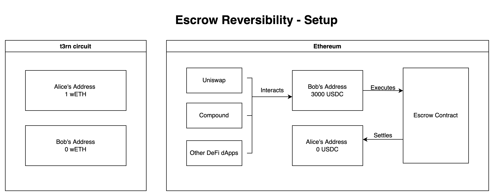
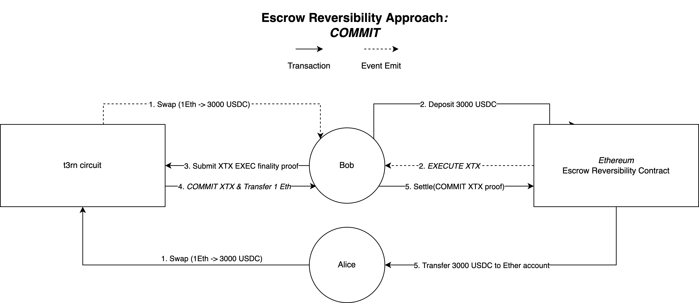
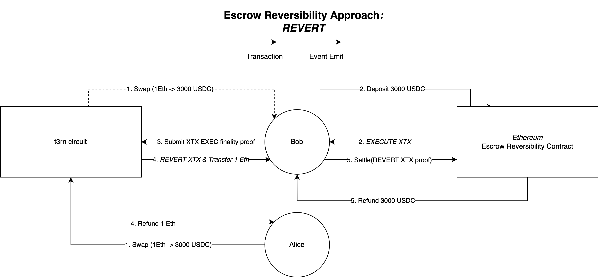

# Escrow Approach

In this article, we will take a look at the escrow smart contract, which is one of the two implementations enabling reversible transactions on target blockchains. We will go through the life-cycle of a reversible, cross-chain transaction, explaining how the different actors interact and how this mechanism is trustless

A high-level understanding of reversibility and the gateway is recommended for the context of this section. Detailed explanations on these topics can be found [here](./).

The escrow reversibility smart contract can be deployed on blockchains connected via an `extrinsic-programmable` gateway. Essentially, these blockchains must allow the permissionless deployment of smart contracts (more on that [here](../gateway/types.md#extrinsic-programmable)). We will go through the lifecycle of a reversible cross-chain transaction on the Ethereum blockchain, using a simple asset swap as an example.

**The example is based on the following:**

* Alice holds 1 wrapped Ether on the t3rn circuit in her wallet, looking to swap it for 3000 USDC on the Ethereum blockchain
* She has an Ethereum address and wants the swapped funds to be sent there
* Bob is an executor, relaying messages between the t3rn circuit and the Ethereum blockchain

To begin the cross-chain transaction lifecycle, Alice submits the transaction describing her swap to the t3rn circuit, attaching the 1 wrapped Ether she is looking to swap. The circuit locks the Ether and emits an event, describing the swap and its conditions as described by Alice.

In this example, Bob is an executor. His goal is to generate fees by executing cross-chain transactions like the one defined by Alice. He is watching the t3rn circuit for events, checking if he is able to execute the transaction and if it makes economical sense for him. In this case, he is able to execute the transaction as he has access to the Ethereum blockchain. Next, Bob calculates his potential reward for executing the swap.

As Alice doesn't care where the 3000 USDC originate from, Bob can source them from anywhere. He can monitor different AMM protocols, looking for the cheapest rate, utilize lending protocols or even source the USDC from his personal account. In this case, Bob decides to provide USDC from his personal holdings, as he wants to reduce his stablecoin exposure. He sends the USDC, along with the swap definition and the `xtx_id` to the escrow contract.

The escrow contract ensures that the `xtx_id` has not been submitted already. If that is not the case, an event is emitted, containing the amount of deposited funds, and the `xtx_id`. Bob forwards the event, along with its finality proof to the circuit. As the circuit contains an Ethereum light client, it can verify the finality proof, proving Bob has submitted a swap to the escrow contract. The circuit also ensures that Bob has deposited the correct amount of funds.

If the finality and the correctness of the transaction is verified, the circuit can finalize the transaction with the `COMMIT` or the `REVERT` event. As the swap was successful, the circuit will emit the `COMMIT` event. In the context of this example, the `REVERT` event isn't important, as Alice's reversible side effect only contains one transaction (the swap). However, it's possible for a side effect to contain multiple transactions. For example, Alice could add a transaction that sends the swapped funds to the t3rn circuit. If this step fails with an error, the circuit would emit the `REVERT` event, causing the reversal of the swap step. This touches on the topic of chaining transaction steps, which is out of scope for this section. For now, it suffices to understand that a `REVERT` can happen, resulting in the reversal of the entire transaction. The details of transaction chaining will be covered in another section in the future.

Continuing with the initial example, Bob sees the event emitted by the circuit, and submits it to the escrow contract, along with the event's finality proof. As the contract has access to verified block headers of the circuit, the finality of the event can be proven. If the submitted event is verified, the contract finalizes the transaction, based on the content of the event (`COMMIT` or `REVERSE`), either releasing the funds to Alice or refunding Bob.

The escrow contract described here allows the trustless reversing of transactions while relying on cryptography for the entire lifecycle of a transaction. The finality of a transaction is purely determined by the correct execution, in our example Bob depositing funds for Alice, and does not rely on any crypto-economic incentives to achieve this.
