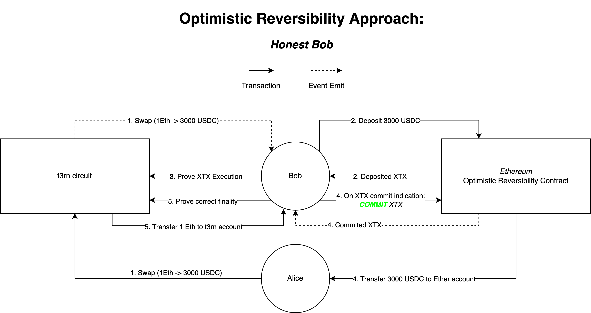
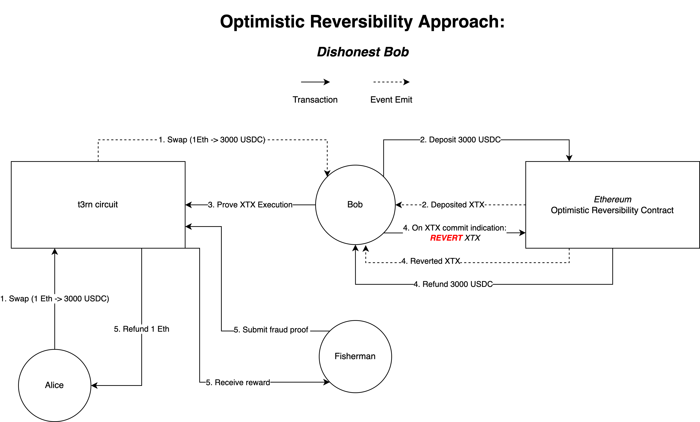

# Optimistic Approach

In this section, we will take a look at the optimistic reversible contract. Currently, two types of reversible contracts exist, the optimistic and the escrow approach. For the context of this section, it is recommended to read the section explaining the [escrow approach](escrow.md) first. We will look at the same example, explaining how the optimistic approach differentiates from the escrow approach.

As the name suggests, this contract is based on the optimistic approach. Optimistic systems generally allow certain actions to happen, before knowing if the action is allowed to happen. Instead of relying on cryptographic proofs to verify the correctness of an action before execution, optimistic systems rely on punishment in case of incorrect behavior. Essentially, the correct execution of an action is achieved by setting crypto-economic incentives.

Like the escrow reversible contract, the optimistic contract must be deployed on a target blockchain connected as an`extrinsic-programmable`. We will go through the same example introduced in the escrow reversible contract explainer and perform a swap on the Ethereum blockchain. Alice submits her transaction to the t3rn circuit, describing her swap and attaching the funds she is looking to swap (1 wrapped Ether) to the transaction. The circuit locks her funds and emits the trade details as an event. Bob sees the emitted event and decides he wants to execute the swap for Alice. Just like in the escrow example, he decides to deposit 3000 USDC from his personal balance. Bob forwards the emitted `EXECUTE` event, along with its finality proof to the circuit, proving that the correct amount of funds have been deposited. Up until here, the two approaches are the same.

In this example, the swap is the only action that is part of the reversible execution. For this reason, the circuit now has enough information to derive how the transaction is going to be settled. Instead of emitting the settlement result of the transaction as an event, the circuit updates its storage, setting the state of the transaction to `COMMIT`, thereby indicating how it should be settled. Contrary to the escrow contract, the settlement, as indicated by the circuit, is not proven in the optimistic contract. For this reason, a storage update suffices, allowing Bob to query the outcome and acting accordingly. Let's go through the two scenarios that are now possible.

### Bob is Honest

Bob sees the state update and acts accordingly, finalizing the transaction with `COMMIT`. The optimistic contract only checks if the signer of the transaction corresponds to the executor who executed the first step of the reversible execution. As this is the case, the contract releases the funds to the address initially defined by Alice and emits the `COMMIT` event. Bob submits this event, along with its finality proof to the circuit. The circuit checks if the event emitted, matches its proposed outcome. As that is the case, it sends the funds locked by Alice in the beginning to Bob.

### Bob is Dishonest

Bob sees the state update but decides to act maliciously, finalizing the transaction with `REVERT`. As Bob is allowed to finalize the transaction, he is refunded the amount previously deposited by himself. The contract emits the `REVERT` event. For Bob this is a problem, as submitting this event to the circuit will not release Alices funds to him. A fisherman sees the event, and realizes the discrepancy between finality defined by the circuit and the contract. The fisherman submits the event to the circuit, receiving a fee for the effort and refunding Alice. Bob has the same amount of funds as before, but had to pay for at least 2 transactions, costing him money.

\[NEED TO DECIDE ON THE BOND AND ADD HERE]

With the optimistic approach, we are not required to verify transaction finality between both blockchains. It is sufficient to only verify the finality of target blockchain transactions on the circuit. One major benefit of this approach is the reduced transaction costs. It is not required to verify the finality of circuit transactions on the target blockchain, which increases the transaction fees quite significantly. A downside to this approach is the added complexity by requiring new network actors and the risk of conflicting settlement-state. A reversible execution can contain multiple transactions, each being processed by a different executor. A conflicting settlement state arises if one executor settles dishonestly. While this can't be exploited for profit, it results in a messy situation. Bonding the executors can disincentivize this situation, it's not possible to prevent it completely, given that an executor is willing to burn its bond.
