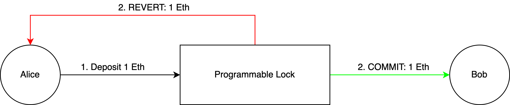
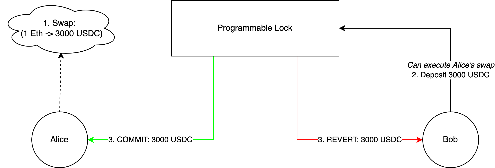

# Overview

In this section, we will focus on transaction reversibility and how the t3rn circuit enables it. In the context of t3rns vision, the reversibility of transactions is a core component, allowing the fail-safe execution of chained, cross-chain transactions.

In this section, will move away from the t3rn circuit and explore how we can make executions on a foreign chain reversible. In the examples presented here, we will use Ethereum as our target blockchain, but other programmable blockchains could be used instead (more on that [here](../gateway/types.md)). We will begin with a simple example, explaining the mechanism, and continue by explaining how this technique can be used for more complex transaction types.

## What is Reversibility

The first thing to define is reversibility and what it means in the context of t3rn. To make this clearer, let's use a simple example: Alice sends 1 Ether to Bob. For now, let's ignore the cross-chain nature of this transaction, and assume the only involved blockchain is Ethereum. Alice signs the transaction and broadcasts it into the network.

As blockchains are immutable by nature, once a transaction is valid and submitted, it can't be removed from the ledger at a later point. Transactions that have taken place will remain in the blockchain forever, so the transfer can't be reversed by somehow removing the transaction from the blockchain. Something we can reverse, however, is the state change that is the result of the transaction. In this case, if Alice receives 1 Eth from Bob, the transaction can be considered reversed. The original transaction is still in the ledger, but the effect or its state-change was reversed. Reversing the state change is always the goal when speaking about reversibility.

### Making it Trustless

With the concept of reversibility clear, it's time to explore how to make this trustless. As we don't want to trust anyone, the reversibility requires a programmable lock, running on the target blockchain, storing state changes until they are settled. Getting back to our example, instead of sending 1 Eth to Bob directly, the Ether is sent to a smart contract, acting as a programmable lock on the Ethereum blockchain. To settle, and thereby finalize the transaction, the transfer can either be committed, resulting in Bob receiving the Eth, or reverted, resulting in a refund of the sender.



## Reversing more complex Transactions

In a simple transaction, like an Ether transfer, the notion of reverting the state change makes sense. We have a sender, a receiver, and an amount, and can settle the transaction to either the sender or the receiver. We update the ownership, and can effectively reverse the transaction. This however becomes more complicated when dealing with more complex transaction types, for example when interacting with smart contracts.

### Reversible Swaps

Let's say Alice wants to swap 1 Ether to USDC on Uniswap. Suddenly we're dealing with different assets, have to follow some exchange rate, and need to make sure all of this can be reversible somehow. While this transaction is a lot more complex compared to the previous example, we can apply the same mechanism to make it reversible. If we break it down, a swap can be seen as a transfer to one-self, with a conversion step in between. We already know how to make transfers reversible, so figuring out how the conversion is achieved makes swaps reversible.

To integrate the swapping, there are really two solutions that can be applied:

**Specialized Approach:**

A custom reversible adapter for Uniswap is created. The Uniswap logic is wrapped, making the wrapped transactions reversible. While this works, it's inefficient and requires a custom integration for every protocol

**Generic Approach:**

If we break a swap down to its most fundamental elements, it can be described with something like this:

```typescript
Swap {
  address assetFrom,
  address assetTo,
  uint amountFrom,
  uint amountTo,
  address receiver
}
```

While this description of a swap abstracts elements like the route and even the swapping application away, a Uniswap swap can be described in this way. At a fundamental level, it doesn't matter where the swapped funds come from, as long as the exchange rate of the swap is correct. It doesn't matter if the funds originate from Uniswap, another AMM, or even originate from a lending platform, as long as the values defined by the swap are actually exchanged with the user.

This abstraction also allows the swaps to be made reversible, using the same mechanism described in the previous example. To explain this mechanism properly, it's important to understand that in this example Alice is paying for the swap, but she is not executing it. This touches on the cross-chain nature of these transactions already, which we want to ignore for the scope of this section. For now, just assume that Alice is paying for the transaction, but Bob is the one executing it for her. The details of the cross-chain nature of these transactions will be explained in the two following articles.



Bob is informed that Alice wants to swap 1 Ether for 3000 USDC, and checks if he can execute the swap for her. As the swap execution is abstracted away, Bob checks how he can execute the swap the cheapest possible way. As Bob is looking to decrease his USDC exposure, he decides to send 3000 USDC from his personal wallet, along with the swap object described above to the smart contract, acting as our programmable lock. As the deposited amount aligns with the swap defined by Alice, it is no different too her. We're now in an interesting position. While we are executing a swap, the reversibility logic is the same as in the previous example, the transfer. We have an asset to send, and a receiver and refunder address, just like in the transfer. Committing the transaction results in Alice receiving the 3000 USDC, and by extension, Bob receiving Alice's payment for the swap. Reverting would result in Bob being refunded his USDC.

In this section, we have described the core mechanism that is used by t3rn to achieve the reversibility of transactions on target blockchains. The scope of this article is focussed only on the core reversibility mechanism, ignoring a lot of the cross-chain context this would be applied in. The goal here is an understanding of the principle, and how we can break down complex transaction types (like swaps) into primitives that can be made reversible in a generic fashion. In the next sections, we will dive into the two different approaches this mechanism can be used with, the escrow and the optimistic approach. In these examples, we will go through the entire lifecycle of a cross-chain transaction, explaining how the approaches differentiate, and how trustless, reversible, cross-chain transactions can be achieved. Reading the escrow approach first is recommended.

<!-- 
[escrow-approach.md](escrow-approach.md)



[optimistic-approach.md](optimistic-approach.md)
 -->
