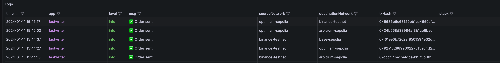
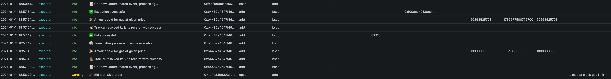
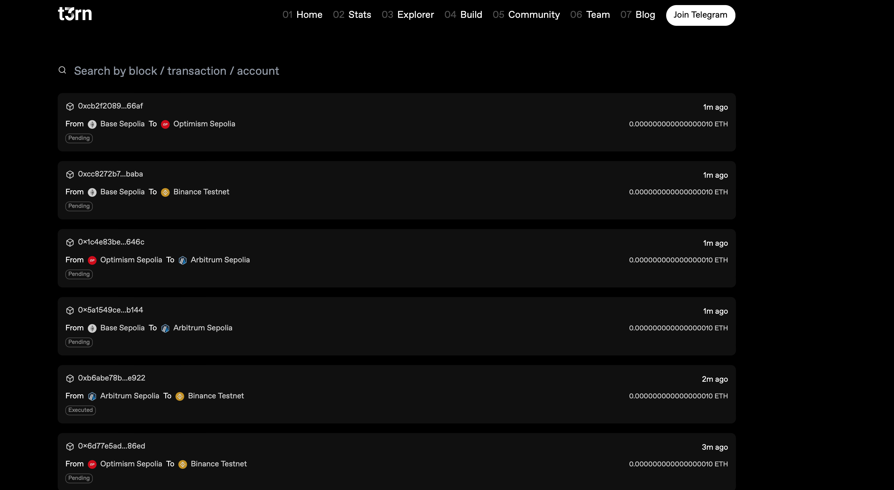

# Executor

This documentation will cover an important actor in the t3rn ecosystem, Executors.

Executors are off-chain participants that can generate yield by executing cross chain transactions that were triggered by an on-chain transaction on the t3rn Circuit. Once the transaction is finalized an inclusion proof is generated, which is then submitted to the t3rn blockchain, proving that the transaction was executed correctly. This unlocks the reward to the Executor, on the t3rn blockchain. Since Executors operate on multiple chains, they periodically need to move funds across chains. Whether they do this through a centralized exchange, OTC, or any other means, is entirely up to them.

Since Executors are in competition with one another, operating in a free-market environment, a fair amount of risk analysis must be done to be efficient and competitive. Users set a maximum reward they are looking to pay, which triggers a reverse bidding where Executors can undercut each other (meaning the bidding starts at the maximum reward and moving downwards), bringing the fees down to a value that makes economic sense for them to carry out the order for.

To further incentivise execution with t3rn, we have a series of three token incentive programs taking place.

**Airdrop 500k TRN tokens to users who submitted Remote Orders from Ethereum.**

**Airdrop of 5k TRN to the top 100 Executors.**

**Airdrop of 1M TRN tokens to the top 10 Executors.**

### [How to become an Executor](https://docs.t3rn.io/components/become-an-executor)

## t3rn protocol


The concept can be compared with intents, or auctions.

### Evaluation formula
Executor fills the orders that undergo t3rn protocol:
submit order -> bid -> execute -> submit proof -> get reward
order evaluation undergoes the following evaluation:

`max reward * reward asset price > gas cost on target + target asset price * target asset amount`

## Architecture

cross-chain orders can be submitted to:
- a) RemoteOrder.sol - smart contracts on Ethereum & EVM compatible chains (e.g. BSC, Polygon, etc.)
- b) Circuit - Substrate's pallet deployed to t3rn on Substrate based chains (e.g. Polkadot, Kusama, Rococo)

### Account Abstraction Layer
** To deem the overall execution architecture easier to process, we're implementing the full EVM-support for all t3rn's Parachains. That means that effectively all orders coming via t3rn's Circuit Pallet can be listened to exactly as if they were coming from Ethereum. ** 

We'll therefore focus on describing the orders handling process from EVMs (Ethereum Virtual Machines) perspective.


### Supported chains
Currently deployed RemoteOrders.sol smart contracts (always consult with latest version on [t3rn's Github](github.com/t3rn/t3rn)): 
- Sepolia (Ethereum Testnet): [0xAc884f5226818BC776F28619671De6790d3C841c](https://sepolia.etherscan.io/address/0xAc884f5226818BC776F28619671De6790d3C841c)
- Arbitrum (Sepolia Testnet): [0x8260C0D28c4BacF8760c270E54955EAAf304B867](https://sepolia.arbiscan.io/address/0x8260C0D28c4BacF8760c270E54955EAAf304B867)
- Base (Sepolia Testnet): [0x031E0DdF42707D7d8e6b1ADF821751d1C4710aDB](https://base-sepolia.blockscout.com/address/0x031E0DdF42707D7d8e6b1ADF821751d1C4710aDB)
- Binance (Testnet): [0x9620Ae05a581FE219e9b157bAF8335b90b5bE100](https://testnet.bscscan.com/address/0x9620Ae05a581FE219e9b157bAF8335b90b5bE100)
- Optimism (Sepolia Testnet): [0x3C28d2c5Bb5aA97B23b8F8b0Cec1015343E19bc9](https://sepolia-optimism.etherscan.io/address/0x3C28d2c5Bb5aA97B23b8F8b0Cec1015343E19bc9)
- Scroll (Sepolia Testnet): [0x2ca26707Cdb7DEE828fC52b37e39D25A94dC50E1](https://sepolia.scrollscan.dev/address/0x2ca26707Cdb7DEE828fC52b37e39D25A94dC50E1)
- Linea - coming soon
- NeonVM (Solana Devnet) - coming soon
- t0rn (Rococo (Testnet) Parachain) - coming soon
- b3rn (Kusama Parachain) - coming soon
- t3rn (Polkadot Parachain) - coming soon


### How to integrate t3rn into a custom AMM?
Follow distinct sections of the [lifecycle](#lifecycle-of-the-cross-chain-order) dedicated to integrators of custom Automated Market Makers (AMMs):
1. [Order evaluation: by Executors](#2-order-evaluation-by-executors)
2. [Order auction: by Executors](#3-order-auction-by-executors)
3. [Order execution: by Executors](#4-order-execution-by-executors)
4. [Order reward claim: by Executors](#5-order-reward-claim-by-executors)

<a id="lifecycle"></a>
## Lifecycle of the cross-chain order

### 1. Order submission: by User
This is typically done by a user, who submits a transaction to the t3rn Circuit. The transaction contains all the relevant information for the Executor to be able to execute & evaluate the transaction. This includes the target chain, the action to be executed, the arguments to be passed, and the reward for the Executor.

To interact with the order function of our smart contract, users must provide parameters including destination (bytes4), asset (uint32), targetAccount (bytes32), amount (uint256), rewardAsset (address), insurance (uint256), and maxReward (uint256). This function encodes these parameters and calls orderMemoryData, creating an order with the specified details. Upon successful execution, the contract emits an OrderCreated event, which includes a unique order ID, details of the order, and the block number. Users can call this function through a web3 provider in their environment, passing the required parameters to initiate and track their order transactions effectively.

```solidity
    function order(bytes4 destination, uint32 asset, bytes32 targetAccount, uint256 amount, address rewardAsset, uint256 insurance, uint256 maxReward) public payable {
        bytes memory input = abi.encode(destination, asset, targetAccount, amount, rewardAsset, insurance, maxReward);
        orderMemoryData(input);
        emit OrderCreated(generateId(msg.sender, uint32(block.number)), destination, asset, targetAccount, amount, rewardAsset, insurance, maxReward, uint32(block.number));
    }
```

```typescript
    // Example - call remoteOrder::order as a user
    const txPromise: Promise<TxResponse> = contract.order(
    params.destination,
    params.asset,
    params.targetAccount,
    params.amountWei,
    params.rewardAsset,
    params.insurance,
    params.maxRewardWei,
    {
        value: params.maxRewardWei,
        gasPrice: txExecParams.gasPrice,
        nonce: txExecParams.nonce,
        gasLimit: txExecParams.gasLimit,
    },
)
```
Output: ```event OrderCreated(
bytes32 indexed id,
bytes4 indexed destination,
uint32 asset,
bytes32 targetAccount,
uint256 amount,
address rewardAsset,
uint256 insurance,
uint256 maxReward,
uint32 nonce
)```

### Run orderer - fast writer
To test out orders submission, we've created an app called FastWriter. It's a simple web app that allows users to submit orders to the t3rn Circuit. Contact the team if you'd like to test it out or customize to your own needs.



#### (Coming soon) 3D Orders - Submitting orders via 3rd party, non-EVM compatible, chains

The introduction of Dynamic Destination Deal (3D) marks a revolutionary stride in addressing liquidity challenges within the t3rn ecosystem. 3D offers a novel approach to asset liquidity, transforming the way assets are brought from target chains to t3rn.

3D simplifies the process of asset bridging. Assets can be swapped directly from the user's wallet on any integrated network, enhancing the user experience significantly.

3D stands out for its ability to allow assets from various chains to be used directly as rewards for orders, bypassing the need to bridge assets to t3rn first. This not only simplifies the process but also opens up new avenues for asset utilization. For example, swapping DOT for ETH no longer requires a two-step process involving t3rn but can be done directly from a user’s wallet on Polkadot.

In essence, 3D represents a leap forward in blockchain interoperability and liquidity management. It's not just a tool; it's a paradigm shift in how we approach asset transactions across multiple chains.

Submission of 3D orders is done via the t3rn Circuit. 3D will come as a part of the Execution flow once the EVM's support is implemented on t3rn's Parachains.


### 2. Order evaluation: by Executors
t3rn protocol is designed to be a free market, where Executors compete with each other to execute orders. 

The Executor's architecture assumes Executor **listen** for orders out of all of the chains, that executor selects to provide the liquidity for.


#### 2.1 Listen for orders emitted by RemoteOrder.sol: by Executors
Listen & Receive the OrderCreated event on one of the networks (see #supported chains and the list of deployed RemoteOrders.sol smart contracts).

```solidity 
event OrderCreated(
    bytes32 indexed id,
    bytes4 indexed destination,
    uint32 asset,
    bytes32 targetAccount,
    uint256 amount,
    address rewardAsset,
    uint256 insurance,
    uint256 maxReward,
    uint32 nonce
);
```

```typescript
// Example - listen for OrderCreated event on EVM-compatible chain in Typescript
  async function listenRemoteOrderEvents(name: string, network: NetworkConfigWithPrivKey) {
    logger.info(
        { address: network.contracts.remoteOrder, network: network.id },
        `⏳ Listening for OrderCreated events on contract RemoteOrder`,
    )

    this.remoteOrderContract[network.id].on('OrderCreated', async (...args: NewOrderEventData) => {
        const order: Order = constructOrderObj(args, network.id);
        evaluateOrder(order, network);
```

### 2.2. Profitability evaluation: by Executors
Once the order is received, the Executor evaluates the profitability of the order. 
From the t3rn's perspective, we cannot decide whether the order is profitable or not - this must be done by the Executor.
**We advocate for and support a secure arbitrage strategy, where executors compare execution costs and the ordered amount against the offered reward. This approach ensures orders are filled efficiently and profitably.**


<a id="arbitrage-strategy"></a>
### 2.2.1 Arbitrage strategy: by Executors 
- **`OrderArbitrageStrategy`** interface is central to our system, allowing executors to define their individualized strategy for order execution. An example of a strategy configuration is as follows:

```jsx
// Example strategy for arbitrage settings on Base for Ethereum asset
export interface OrderArbitrageStrategy {
    minProfitPerOrder: BigNumber // in target asset
    minProfitRate: number // in %
    maxAmountPerOrder: BigNumber // in target asset
    minAmountPerOrder: BigNumber // in target asset
    maxShareOfMyBalancePerOrder: number // in %
}

const defaultSettings: OrderArbitrageStrategy = {
    minProfitPerOrder: BigNumber.from('1'),
    minProfitRate: 0.1,
    maxAmountPerOrder: BigNumber.from('1000'),
    minAmountPerOrder: BigNumber.from('5'),
    maxShareOfMyBalancePerOrder: 25,
}
```

** All of the amount parameters are denoted on 18 decimals precision! **

** That means, that e.g. setting `minProfitPerOrder` to 1, sets it with value = 1 Wei (0.000000000000000001 ETH) **

Each field in this strategy configuration plays a specific role:

1. **`asset` (string)**: Specifies the target asset for the arbitrage strategy, such as 'eth' in the given example. This defines the type of asset the executor will be dealing with.
2. **`minProfitPerOrder` (BigNumber)**: The minimum profit, in the target asset, that an executor aims to achieve for each order. In the example, '1' indicates the executor expects at least 1 ETH of profit per order.
3. **`minProfitRate` (number)**: This is the minimum profit rate, expressed as a percentage, that the executor seeks to achieve. A '0.1%' rate implies that the profit must be at least 0.1% of the total order value.
4. **`maxAmountPerOrder` (BigNumber)**: This sets the upper limit on the amount, in the target asset, that the executor is willing to handle in a single order. The example sets this limit at 1000 ETH.
5. **`minAmountPerOrder` (BigNumber)**: Conversely, this is the minimum order amount, in the target asset, that the executor is willing to handle. In our example, the minimum is 5 ETH.
6. **`maxShareOfMyBalancePerOrder` (number)**: This represents the maximum percentage of the executor's total balance in the target asset that can be used for a single order. The example strategy limits this to 25% of the executor's total ETH balance.

When the **`evaluateDeal`** function is called on each received order, it uses these parameters to assess the profitability of an order. It calculates the potential profit and checks it against these strategy thresholds. If the order meets or exceeds the specified minimum profit, profit rate, and amount constraints while staying within the maximum amount and balance share limits, it is deemed profitable. This strategy ensures executors can optimize their returns while managing risks according to their predefined preferences.

### 3. Order auction: by Executors
If the order is profitable, the Executor submits a bid to the t3rn Circuit. The bid is a transaction that contains the Executor's address, the order ID, and the bid amount. The bid amount is the amount the Executor is willing to accept as a reward for executing the order. The Executor with the lowest bid is selected to execute the order. The Executor is then responsible for executing the order (by sending ordered amount of target asset to orderer's target account - step 4.)

```solidity
function bidFifo(bytes32 sfxId) public {
    // Check if the payload is already stored and return false if it is
    require(isKnownId(sfxId), "Payload not found");
    require(orderWinners[sfxId] == address(0), "Order already won");
    orderWinners[sfxId] = msg.sender;
    emit BidReceived(sfxId, msg.sender);
}
```

```typescript
    // Example - call remoteOrder::bidFifo as an executor
    const txPromise: Promise<TxResponse> = contract.bidFifo(
        params.sfxId
    )
)
```
Output: ```event BidReceived(
    bytes32 indexed id,
    address indexed winner
)```

Since bidding is available to all executors, it is crucial to ensure, that executor's account is assigned as a winner. This is done by the `orderWinners` mapping, which stores the executor's address for each order ID. If the executor's address is already stored, the bid is rejected.
```typescript
// Ensure that the bid was successful by reading the storage of the remoteOrder contract on source
const assignedBidder = await this.remoteOrderContract[order.source].orderWinners(order.id)
if (!bidTransmitterReceipt.success || assignedBidder !== walletAddressSource) {
    this.prometheus.bidFailed.inc({ sourceNetwork: order.source })
    // If bid was reverted then decode the revert reason and log it. Possibly it was to other executor
    logger.warn(
        {
            id: order.id,
            sourceNetwork: order.source,
            destinationNetwork: order.destination,
            err: bidTransmitterReceipt.error,
            assignedBidder,
            myAccount: walletAddressSource,
        },
        `🥀 Bid lost. Skip order`,
    )
    return
}
```

### 4. Order execution: by Executors
Execution phase follows after successfully won Bid for a given order. 
Executor has 128 blocks measured on Source chain to fulfil the order. Assuming 12s block time, it's about 25 minutes. Otherwise, the Executor loses the certainty to score the offered reward - since user can request a refund of the max reward deposit.

Execution is done by sending the ordered amount of the target asset to the orderer's target account on **destination** chain. We recommend using the dedicated `execute` function of remoteOrder smart contract for this purpose. This function takes the order ID as a parameter and transfers the ordered amount of the target asset to the orderer's target account. It also emits an `Confirmation` event, which includes the order ID, the target's address, amount and asset. This event is used to track the execution of the order. 
- supports execution in both Native currency of destination chain and ERC20 tokens.
- supports batching - multiple orders can be executed in a single transaction, this is especially useful for Ethereum, where the gas costs are high (`function confirmBatchOrder(ConfirmBatchOrderEntry[] calldata confirmBatch) public payable`)

```solidity
function confirmOrder(bytes32 id, address payable target, uint256 amount, address asset) public payable returns (bool) {
    // Send the amount to the target
    if (asset == address(0)) {
        if (msg.value < amount) {
            return false;
        }
        (bool sent, bytes memory _data) = target.call{value: amount}("");
        if (!sent) {
            return false;
        }
    } else {
        // Send the amount from users balance to the target; check if the allowance is enough
        if (IERC20(asset).allowance(msg.sender, address(this)) < amount) {
            return false;
        }
        IERC20(asset).safeTransferFrom(msg.sender, target, amount);
    }
    emit Confirmation(id, target, amount, asset);
    return true;
}
```

Output: ```event Confirmation(
    bytes32 indexed id,
    address indexed target,
    uint256 indexed amount,
    address asset
)```

```typescript
// Example - call remoteOrder::confirmOrder as an executor
const txPromise: Promise<TxResponse> = contract.confirmOrder(
    params.id,
    params.target,
    params.amount,
    params.asset,
    {
        value: params.amount,
        gasPrice: txExecParams.gasPrice,
        nonce: txExecParams.nonce,
        gasLimit: txExecParams.gasLimit,
    },
)

```
### 5. Order reward claim: by Executors

Once the order is executed, the Executor can claim the reward. Similar to the execution, the reward claim is done by calling the dedicated `claimPayout` function of the remoteOrder smart contract. This function takes the order ID as a parameter and transfers the reward amount to the Executor's address. It also emits a `Claim` event, which includes the order ID, the Executor's address, and the reward amount. This event is used to track the reward claim. 
- supports batching - multiple orders can be claimed in a single transaction, this is especially useful for Ethereum, where the gas costs are high (`function claimPayoutBatch(Payout[] memory payouts) public payable`)

```typescript
// Example - call remoteOrder::claimPayout as an executor
const nativeAssetToClaim = ADDRESS_ZERO // address(0) for native currency of destination chain
const erc20TokenAssetToClaim = '0x6b175474e89094c44da98b954eedeac495271d0f' // example DAI token address
const isClaimable = await this.remoteOrderContract[network.id].checkIsClaimable(
    orderId,
    orderToClaim.isNative ? nativeAssetToClaim : erc20TokenAssetToClaim,
    orderToClaim.maxReward,
)

if (isClaimable) {
    const txPromise: Promise<TxResponse> = this.remoteOrderContract[network.id].claimPayout(
        orderId,
        orderToClaim.isNative ? nativeAssetToClaim : erc20TokenAssetToClaim,
        orderToClaim.maxReward,
        {
            gasPrice: txExecParams.gasPrice,
            nonce: txExecParams.nonce,
            gasLimit: txExecParams.gasLimit,
        },
    )
}
```

Optionally, executors can listen to the TransferCommitApplied emitted by Attesters contracts on each source chain. This event is emitted when the reward is transferred to the Executor's address. This event can be used to track the reward claim. 

```solidity
event TransferCommitApplied(bytes32 indexed sfxId, address indexed executor);
```

```typescript
// Listen for TransferCommitApplied event on EVM-compatible (source of orders) chain in Typescript
async function listenToTransferCommitAppliedEventsAndClaim(name: string, network: NetworkConfigWithPrivKey) {
logger.info(
    { address: network.contracts.remoteOrder, sourceNetwork: network.id },
    `⏳ Listening for TransferCommitApplied events on ${name} for contract Attesters contract`,
)
this.attestersContract[network.id].on('TransferCommitApplied', async (...args: any[]) => {
    const [orderId, committedBeneficiary] = args
    logger.info(
        {
            id: orderId,
            committedBeneficiary: committedBeneficiary,
        },
        `📝 TransferCommitApplied event received`,
    )
```

### 6. Order refund: by User
This part is irrelevant for Executors, but it's important to understand the full lifecycle of the order.
If the order is not executed within 128 blocks, the user can request a refund of the max reward deposit. This is done by calling the dedicated `claimRefund` function of the remoteOrder smart contract. This function takes the order submission block number in order to derive distinct order ID, as well as reward asset and max reward. It also emits a `Claimed` event, which includes the order ID, the user's address, and the max reward amount with reward asset. This event is used to track the refund.
- supports batching - multiple orders can be refunded in a single transaction, this is especially useful for Ethereum, where the gas costs are high (`function claimRefundBatch(RefundAfterTimeout[] memory payouts) public payable `)

```solidity
function claimRefund(uint32 orderSubmissionBlockNumber, address rewardAsset, uint256 maxReward) public payable {
    // Check if Refund timeout is satisfied
    require(block.number >= orderSubmissionBlockNumber + 128, "Order has not timed out");
    // Derive order ID from the order submission block number and the user's address
    bytes32 sfxId = generateId(msg.sender, orderSubmissionBlockNumber);
    // Withdraw the reward as refund
    bytes32 paymentPayloadHash = keccak256(abi.encode(rewardAsset, maxReward));
    bytes32 paymentHash = escrowGMP.getRemotePaymentPayloadHash(sfxId);
    bytes32 calculatedRefundHash = keccak256(abi.encode(paymentPayloadHash, address(0)));
    require(paymentHash == calculatedRefundHash, "Payload for refund not matching");
    escrowGMP.nullifyPayloadHash(sfxId);
    if (rewardAsset == address(0)) {
        payable(msg.sender).transfer(maxReward);
    } else {
        IERC20(rewardAsset).safeTransfer(msg.sender, maxReward);
    }
    emit Claimed(sfxId, msg.sender, maxReward, rewardAsset);
}
```

```typescript
// Example - call remoteOrder::claimRefund as a user
const txPromise: Promise<TxResponse> = contract.claimRefund(
    params.orderSubmissionBlockNumber,
    params.rewardAsset,
    params.maxReward,
    {
        gasPrice: txExecParams.gasPrice,
        nonce: txExecParams.nonce,
        gasLimit: txExecParams.gasLimit,
    },
)
```

### Gas Costs Breakdown

| Action          | Payer    | Cost (GAS)                                        | Remarks |
|-----------------|----------|---------------------------------------------------|---------|
| **Order**       | User     | Avg. 68,000                                       |         |
| **Bid**         | Executor | Avg. 54,000                                       | After t3rn is deployed on Polkadot, bids on active + valid orders will cost 0 GAS, as the bidding process will be integrated into the t3rn Circuit pallet. |
| **Execute**     | Executor | Native: 21,000 <br> ERC-20: Avg. 50,000 <br> Using `remoteOrder::confirmOrder`: Avg. 41,000 <br> Using `remoteOrder::confirmBatchOrder`: Avg. 41,000 GAS / X in a batch |         |
| **Claim Reward**| Executor | Batch: Cost of single claim / X in a batch <br> ERC-20: Avg. 60,453 <br> Native: Avg. 40,521 |         |


### How to run t3rn's default Executor with Arbitrage strategy?
1. Clone the executors [t3rn repo](https://github.com/t3rn/guardian): 
2. Install pnpm (if not installed already): `npm install -g pnpm`
3. Install dependencies: `pnpm install`
4. Set your keys for dedicated networks in `.env` file (see `.env.example` for reference)
```
export ARBITRUM_SEPOLIA_PRIVATE_KEY=0x0e5b64068e340f44bc99a47951685f96051d28d6f23a9e8c527f64a8c53691d7
export SCROLL_SEPOLIA_PRIVATE_KEY=0x0e5b64068e340f44bc99a47951685f96051d28d6f23a9e8c527f64a8c53691d7
export BINANCE_TESTNET_PRIVATE_KEY=0x0e5b64068e340f44bc99a47951685f96051d28d6f23a9e8c527f64a8c53691d7
export SEPOLIA_PRIVATE_KEY=0x0e5b64068e340f44bc99a47951685f96051d28d6f23a9e8c527f64a8c53691d7
export BASE_GOERLI_PRIVATE_KEY=0x0e5b64068e340f44bc99a47951685f96051d28d6f23a9e8c527f64a8c53691d7
export BASE_SEPOLIA_PRIVATE_KEY=0x0e5b64068e340f44bc99a47951685f96051d28d6f23a9e8c527f64a8c53691d7
export OPTIMISM_SEPOLIA_PRIVATE_KEY=0x0e5b64068e340f44bc99a47951685f96051d28d6f23a9e8c527f64a8c53691d7

export ENABLED_NETWORKS='base-sepolia,optimism-sepolia,binance-testnet,scroll-sepolia,arbitrum-sepolia'
export RPC_HEALTH_CHECK_INTERVAL_SEC=3
export PRICER_PROVIDER_URL='https://rpc.ankr.com/multichain/ae45090060327148428269ea88b3801903f4c81f8a700d8f04dc99a6cb3cb7ac'
export PRICER_USE_MULTICHAIN='false'
export PRICER_CLEANUP_INTERVAL_SEC=60
export EXECUTOR_MIN_BALANCE_THRESHOLD_ETH='0.1'

export LOG_LEVEL=debug
export LOG_PRETTY=true

# Prometheus
export PROMETHEUS_PORT_EXECUTOR=9334

source_env .envrc.local
```
5. Run Executor: `source .envrc && pnpm start:ranger`
6. Re-define your arbitrage strategy in `src/config/executor-arbitrage-strategies.ts` file. Set supported assets on supported chains and your arbitrage strategy for each of them, by modifying the `defaultSettings` object:
```typescript
const defaultSettings: OrderArbitrageStrategy = {
  minProfitPerOrder: BigNumber.from('1'),
  minProfitRate: 0.1,
  maxAmountPerOrder: BigNumber.from('1000'),
  minAmountPerOrder: BigNumber.from('5'),
  maxShareOfMyBalancePerOrder: 25,
}

export default {
  eth: {
    eth: {
      ...defaultSettings,
    },
  },
  bsct: {
    eth: {
      ...defaultSettings,
    },
  },
```
Revisit [arbitrage strategy section](#arbitrage-strategy) for more details on the arbitrage strategy configuration.



### Explorer
Visit [stats.t0rn.io/explorer](https://stats.t0rn.io/explorer) to see the orders submitted to t3rn's testnet.



### Troubleshooting
Feel free to reach out to us on [Discord](https://discord.gg/3t3rn) if you have any questions or issues.
With obvious errors, please open an issue on [t3rn's Github](https://github.com/t3rn/t3rn/issues/new/choose)
