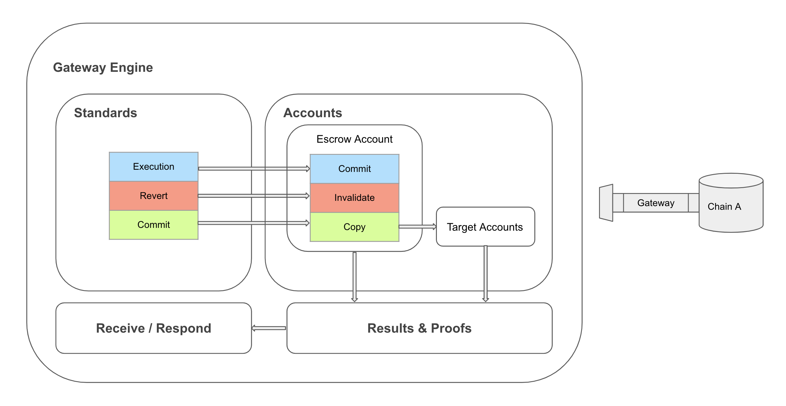

## Gateway

t3rn comes with the standalone Gateway pallet for multi-steps transaction processing that brings a possibility of safely reverting the changes based on external of parachain factors and spread over time. 

The standalone version of the gateway brings additional phases over the regular runtime execution - commit and revert, due to which effects of the execution can be reverted and never committed to the target accounts. This is possible, as after the execution phase the changes are made only to the child storage of dedicated on that parachain Escrow Account, which acts as a regular account from the perspective of a parachain, therefore all of the changes to its storage are secured by the consensus effective in that parachain and can be relied on by already integrated services. 

### Standalone Gateway vs Interoperable Circuit
Creating the standalone Gateway constitutes the first phase of work on the interoperable t3rn protocol. As a result of that phase, Gateway comes as the pallet which can be included in parachains as an additional utility that brings multiple phases and reversibility into execution. Within the standalone Gateway, developers can create the reversible logic within the context of a single parachain.
The appropriate tools for the compilation of contracts and modules that work on the multiple phases environment operated by the Gateway are also the result of the first development phase.  

The system automatically overseeing and ordering the execution of the phases over multiple registered parachains - Gateways Circuit will become the result of the next development phases of the interoperable protocol. 

Developers might want to create the packages within the standalone gateway context, even after the interoperable protocol is ready. This is beneficial while designing the logic that might or might not happen depending on the external of the parachain variables. In that sense the standalone Gateway needs to satisfy the following requirements:
- Execution of the same package, input and accounts state yields with deterministic output in the form of returned results and the changes to the storage of affected accounts.
- Phases are supported by proofs of execution and inclusion into a parachain state
- Introduce multiple phases into the execution, so that changes can still be reverted based on an external factor
- Acts as an escrow and guarantee for external systems. Can serve as a commitment that results will be transferred from the Escrow Accounts to the original accounts after the final phase. 
- Produces proofs of execution and inclusion which can be presented to external services. The changes into Escrow Account are already committed to the parachain state, therefore can be relied on with the same dose of trust as for any other transactions on that parachain.

## Parachains Support
t3rn can be easily integrated into existing and new Parachains. There is a dedicated Gateway pallet to do so, modelled to be very similar to Contracts pallet, therefore giving the same developer experience and functionality while creating t3rn Contracts. Gateway Circuit oversees, synchronises and secures the interoperable execution between Parachains involved. 

#### Note on the standards available in parachains that do not support the Contracts pallet

Depending on whether a parachain supports the Contracts pallet or only the Balances pallet, a different version of Gateway pallet needs to be integrated. This is due to the different fee system strategy and the confidentiality concerns connected with potential unauthorized data access and updates by packages executed via gateway that may be a threat to the original purpose parachain. 

Albeit, it is possible to implement, as part of the gateway, the equivalent of the external execution context for the standard functions as the one listed in `Standards` subsection, that would implement exactly the same set of functions for parachains supporting only Balances pallet. 

Standards for Runtime Execution can be implemented in a similar vain as the standards for parachains supporting Contracts pallet are implemented - with the support of multi-step execution. During registration of a parachain, a registrant could specify the list of standards that the parachain support, that do not present a threat to its functionality. All of the standards from that set could then afterwards be used to design the packages executed via Gateway on that parachain. 

As of now, the protocol is designed to "manually" register packages that the parachains will support by exposing the host functions. That is showcased with the "build house" example in the section "Register new Packages". This presumption may change during the development of the initial phase. It's the consideration for the later development phases of the t3rn protocol, as during the initial phase the registry of parachains will not be worked on yet.

### Multi-step transaction lifecycle within a Standalone Gateway
In case some services need to introduce a transaction consisting out of several atomic steps and all of them (or some of them) need to be confirmed in order to consider the overall transaction successful, t3rn could prove itself useful. Let's call it a multi-step transaction. A step on each Gateway implemented into a particular parachain consists always as a phase tuple: execute & commit or execute & revert. The multi-step transaction can iterate over many phase tuples either on the same or multiple parachains.

Here are the major steps in the lifecycle of the multi-phase transaction, which can be executed within a single or multiple Standalone Gateways:

#### 1. Compile multi-step transactions

Create, sign a multi-step transaction and compile it to the package form which contains WASM Binaries and metadata necessary for processing on the Gateway. 
As part of the first phase, there will be a compiler for multi-step transaction that translates the contracts and modules into the transactions which can be accepted as regular contract calls for the parachains with Contract pallet or like a regular transaction addressed to the Gateway Module for the parachains with Balances pallet.

```rust
struct multistep_call_tx {
    origin: AccountId,
    dest: AccountId,
    signature: ed25519::Signature,
    value: Balance,
    gas_limit: number::NumberOrHex,
    input_data: Bytes::GatewayStep,
}
```

Packages and their examples are described more in details in the section "Package, Module, Contract" of t3rn protocol. It's worth noting, that within the first phase - Standalone Gateway there is no need for registering packages anywhere, just executing them within a context of that specific parachain via the gateway. The transaction contains all necessary executables in the form of the input arguments and the WASM Binaries, so in case of parachains there is no need for instantiating these binaries as packages.  

#### 2. Execute and validate first phase
On parachain that supports the Standalone Gateway, execute the `multistep_call` provided by the Gateway API, passing that transaction including necessary data.
`Execution` is the first phase of every multistep transaction. Gateway Engine executes the provided package in a given context:
- step: one of three phases of multi-step transaction: `Execute`, `Commit`, `Revert`.
- input: optional data which can be passed to the package call as arguments.
- target_accounts: accounts specified by developers in packages that the changes will be effective to in case the mutli-step transaction succeeds, until the during the `Execute` and `Revert` phases the code will be executed against the copies of those accounts and the results stored in an escrow account.
- package: WASM Binaries, the executables of the package. 3rd party services can execute that logic too and check whether the effects result in the same state of the target accounts. 
```rust
enum Step {
    Execute,
    Commit,
    Revert
}

struct StepInput {
    step: Step,
    input_args: Option<Bytes>,
    target_accounts: Vec<AccountId>,
    package: Bytes,
}
```
During the `Execution` phase the business logic specified by the package will be executed against specified in the package target accounts. The main goal of the Gateway is to execute the business logic as close to the target execution as possible but to provide a way to make the operations reversible. This is accomplished by running the package on copies of target accounts first. The copies of accounts are saved in the state of Escrow Account, together with the merkle path in the state tree of a block preceding the execution. After the execution accounts data alongside with the binaries hash and paid fees are also stored under the same key.

```rust
struct EscrowExecutionRecord {
    state_before: Vec<AccountData>,
    state_before_path: MerklePath,
    state_after: Vec<AccountData>,
    fees: Option<Gas>,
    executables_hash: CodeHash,
}

struct MerklePath {
    nodes: Vec<Vec<u8>>,
}
```
Each accounts data consisting of:
- account: address of that account
- balance: available balance of that account
- storage: storage of that account
- state_path: merkle path to that storage within the storage tree
```rust
struct AccountData {
    account: AccountId, 
    balance: BalanceOf, 
    storage: Option<Vec<u8>>, 
    state_path: Option<MerklePath>,
}
```

After the package is executed, Gateway Engine is responsible for getting the required proofs out of newly created parachain block.
To proof the results of the `Execution` and `Revert` phases, it's only necessary to deliver the merkle path to the corresponding change of the multi-step transaction entry within the Escrow Account storage - `escrow_path`. No changes has been made in the target accounts yet. Changes to the storage of Escrow Accounts are also required to be proofed after `Commit` phases but what's more important, changes to the actual state tree of parachain needs go also with the proof in the form of the merkle path to all target accounts that changes were successfully committed within the new block - `state_paths`. 
The block header hash of a parachain that the changes are included in is attached to the proof. Any service having an access to solely block headers API of that parachain can validate presented by Gateway proof by:
- fetching a block header denoted by the block header hash
- fetching a block header denoted by the proceeding block
- verifying that merkle paths of Escrow Account and Target Accounts result in the state root of collected blocks. 

Inclusion is proved by presenting the merkle path to the corresponding extrinsic commited by the current step of the transaction within the newly added block and its extrinsics tree.
Each step consists out of input used to perform the execution, output saving the changes to the storage of escrow accounts and passing optional results and proof of that execution on that parachain.
```rust
struct StepOutput {
    result: Option<Bytes>, 
    escrow_record: GatewayExecutionRecord,
}

struct StepProof {
    block_header_hash: Block::Hash,
    execution: StepExecutionProof,
    inclusion: MerklePath, // Path in extrinsics tree
}

struct StepExecutionProof {
    escrow_path: MerklePath,
    state_paths: Option<Vec<MerklePath>>,
}

struct GatewayStep {
    input:  StepInput,
    output: StepOutput,
    proof:  StepProof,
}
```
#### 3. Decide on the next phase - Commit or Revert
The output of each `Execution` phase of multi-step transaction containing results and proofs can be presented to external (from the parachain) services. It could be another Standalone Gateway too. In the following development phases of t3rn protocol, Gateway Circuit will be responsible for validating the execution on each Gateway and deciding on whether entering the `Commit` or `Revert` phase. Its worth noting, that if multi-step transaction consists out of many atomic operations, it's possible to introduce the optional ordering and requirements on when to classify the transaction as incorrect and which of the previous phases should be reverted.
This step should be concluded with sending another call to the Gateway API with updated context, causing `multistep_call` to execute either `Commit` or `Revert` phase on the Gateway. 

#### 4. Execute second and the last phase

Gateway Engine receives either the order to commit or revert the changes obtained, "pre-ordered", after the previous execution.

The goal of the `Commit` phase is to:
- Ensure that the state of target account hasn't changed since the `Execute` phase. This is possible, as the state of all of target accounts is saved in the storage of Escrow Account and at that point the correctness of execution is validated. There might be a risk here, that in between the `Execution` and `Commit` phases target accounts are mutated in the way invalidating the execution. There can be several approaches here, ideally configurable by developers depending on the business specifics of the multi-step transaction:
    - cancel the `Commit` phase and change to the `Revert`  the transaction and all of the remaining gateway steps if accounts are mutated
    - if accounts are mutated try repeating `Execution` step on that gateway on the new account state. Proceed with the current phase if successful, fallback to `Revert` phase if not.
    - use locks on balances from Balances pallet for packages that rely on the balance transfers. 
    - introduce the native support for temporarily freezing accounts after the `Execution` phase. This should be considered with extra caution, as freezing the account can interfere with other functionality on that parachain.
    
- Commit the changes from the stashed account copies to the target accounts and present the corresponding proofs from the state tree of newly created block.

The new corresponding entry is created to Escrow Account after the `Commit` phase to prove that at the time when the last step was being processed there was no mutation on the target accounts from the state after `Execution` phase.

The goal of the `Revert` phase is to invalidate the entry of corresponding transaction hash within the storage of Escrow Account. To the `revert` entry in the storage appears the revert record, that may contain the optional message pointing to the cause of the transction revert. No action is needed on the actual target accounts, as the `Execution` was only made on their copies and stored in the Escrow Accounts.

After the both of the phases of multi-step transaction are executed, the complete entry in the storage contains the records for at least two finished phases. The scheme is included in the "Engine" subsection.

### Package, Contract, Module

In this document, a package stands for either a module or a contract (or multiple modules and/or contracts introducing a related functionality) that is already compiled to the form enabling interoperable execution with multiple execution phases. Most of the time a package, module or contract is mentioned it is used as a t3rn-specific one, intended to work specifically in the interoperable context. A module in contrary to a contract can set additional `source`  and `private` parameter if the source code should remain private and the sources will be hosted on a different parachain. To summarize:
- package: executables ready to be deployed over multiple gateways
- contract: business logic that is written in a t3rn contract-like, Rust-based language. The source code of packages is public by default. Contracts 
- module: business logic that consists out of non-standard operations which is executed within the context of a specific runtime parachain. The module needs to be written in a way conforming into the multi-phase execution. The source code of a module might remain private, as the module will be hosted by a specific parachain only and can be confidential. The new module extends the host functions of execution engine on that parachain. Yet, the interface is public as it is for contracts, so it's accessible for other packages. The example of a new module that is being registered is posted below in this section.

Developers can create the executables for the standalone Gateway that aren't meant to be executed within the Gateway Circuit, but via other trusted service instead. This is the result of the initial development phase of t3rn protocol when Circuit isn't there yet. 

The compiler translates modules and contracts into executable packages:
- containing multiple steps depending on the number of parachains involved in the multi-step transaction execution
- each step consists out of:
   - WASM binaries targeted to be executed on Gateway
   - Source code if not private
   - Interfaces description with types
   - Metadata info hosting parachain and the access details
  
#### Register new Packages

The easiest way to register new packages is to write an ISC - Interoperable Smart Contract. As all ISC are hosted by t3rn network all of the ISC packages are automatically available for other developers to use. The registry oversees all of the packages and contains the extra metadata interesting for developers.  

During the registration of a package, developers can specify multiple additional parameters like an execution cost. The fees from execution of a given functions will be transferred to its creator. That's interesting, it opens up a new way for developers of earning money for writing Open Source code.

t3rn comes the compilers for packages that work in similar vain as the compiler of !Ink contracts. The compiler translates the contract or module into the WASM Binaries and attaches necessary metadata required by Gateway Circuit.

```
// Register a free of charge contract. Alleged for contracts: `source=*`, `private=false`. Default for contracts `access=free`, `owner=signer`.

#[tern::contract(owner=tern::owner:signer, access=tern::access:free, version = "0.1.0")]
mod my_contract { ... }

// Register a package which can only be executed on MyChain and costs 1000. 
#[tern::module(owner=tern::owner:AccountId("0x123"), access=tern::access:costs(1000), private=false, source=tern::MyChain, version = "0.1.0")]
mod my_package { ... }
```

Packages consist out of binaries and the interface description (input and output). Moreover each package and contract has several attribute controlling the access:

- `package::source: parachain` - by default it's set as `*`, meaning that the package can be executed on any parachain. 
- `package::domain: &[u8]` - domain, that makes it easier cluster the business logic provided by the package into the interoperable standards.
- `package::private: bool` - `false` by default, indicates whether to share the binaries with the network or not. If set to `true` Circuit cannot verify the package's results. Contracts cannot be private as the binaries need to be known for the execution.
- `owner: AccountId` - by default it's the package signer. Account that owns the package, which:
    - is set in the `self.address()` context
    - covers the execution costs of the package and all of the outgoing calls out of that package,
    - can be set to other Account than a signer, which should be helpful for accounts being services, which only charge t
- `access: Access` - access to package which can have multiple forms: 
    - `free` -  package execution is free of charge
    - `costs` - other packages need to pay for the execution, the execution costs will be transferred to the package owner.
    - `subscription` - only accounts with active subscription have access to that package.
    
While developing a contract developers should be aware of the t3rn Circuit Execution protocol introducing multiple execution phases, as from the Circuit Context packages may use necessary information.     
While developing a private package, developers need do be aware of the different execution phases. Creating new private package is no different than creating a new Standard for the Gateway connecting a given parachain.

The following example showcases both of the mentioned examples - uses deposits and registers private package:

```Rust

    #[tern::contract(access=tern::access:free, owner=AccountId(b"0xhouse_chain_owner_addr") private=true, version = "0.1.0")]
    fn buy_house(&self) {
        Promise.all((
            WoodChain::transfer::auto(to=self.env().self_account(), value=100),
            StoneChain::transfer::auto(to=self.env().self_account(), value=50),
        )).then(|_| {
            HouseChain::build_house(buyer=self.env().caller());
        });
       
    }
    #[tern::module(private=true, source=tern::HouseChain, version = "0.1.0")]
    fn build_house (&self, buyer: AccountId) {
        match self.ctx.step {
            "exec" => {
                // Check if the deposit in Wood and Stone was made for a house. Two ways of doing it:
                // 1. Manually ensure (call get_deffered_tx) out the the Circuit Context 
                // 2. Include the automatic check on the Circuit by specifying the access macro:
                //  "access=tern::access:costs(Vec<(100, t3rn::WoodChain), (50, t3rn::StoneChain)>)"
                let deffered_wood_tx = get_deffered_tx(self.env().account(), parachain::WoodChain, ctx);
                let deffered_stone_tx = get_deffered_tx(self.env().account(), parachain::WoodChain, ctx);
                if (deffered_wood_tx.value == 100 && deffered_stone_tx.value == 50) {
                    return Error("Not enough resources provided for a house");
                }
                
               // Build a house for a caller, the secret recipe for building a house remains hidden.
               let house = build_house(self.env().caller);                
               // Store the house in Runtime's own memory - 
               Houses.put(b"house_for_" + self.env().caller, house);
               // As a result return a hash, that may convince a user that the house is built.
               house.encode_and_hash();
            },
            "revert" => {
               // Store the house in Runtime's own memory
               Houses.remove(b"house_for_" + self.env().caller);
            },
            "commit" => {
               Houses.remove(b"house_for_" + self.env().caller);
            }
        }
    }
```

All packages and contracts are stored and maintained by the t3rn network through Registry. Developers have access to all of the packages and Registry should provide the additional information about the package support and current usage statistics.  

Ideally, registered packages and contracts bring clear value to the blockchains interoperability, convincing enough for other Developers to include them in their packages.

#### Accounts Context
Smart Contracts in a domain of a single chain charge the contract's caller for the execution of the logic and the storage used and assigned to that account.

##### Escrow Accounts
 In interoperable execution accounts and contracts are located on different chains, therefore a caller willing to invoke two smart contracts on different chains needs to setup two different accounts, call the contracts individually and pay for the execution in two currencies. t3rn aims to solve that complexity by introducing the escrow accounts registered on each connected parachain which can control the access to balances and any other storage resource after receiving an authorised order from Circuit. The escrow account is not controlled by any third party and operates solely on the base of its preprogrammed logic. This comes with several advantages:
     - escrow accounts are just accounts like any other and if a contract is attached to it they are charged for the code execution following the requirements of either Balance or Contracts pallet (the escrow accounts are visible as a caller for Parachains Contracts). Escrow accounts need to be pre-paid by t3rn validators in order to be functioning (major drawback). In exchange the escrow accounts share the billing information with the Circuit, which is able to convert and aggregate the fees from multiple parachain and charge the Interoperable Contract caller who needs to have only one account set up and is charged in one currency only at the end of execution.
    - Any change to escrow account can be invalidated as specified by t3rn protocol different execution phases.
    - Execution proofs can be easily computed out of the changes to escrow accounts.
The drawback of introducing escrow accounts is the additional implementation and maintenance complexity as the validators need to ensure the enough liquidity on all Parachains they support to afford the packages execution.  

The context of Interoperable contracts and packages is slightly more complicated: 

`escrow_account` - owned by the validators is available in the context of contracts and packages.

`self_account` - the Account of a the package/contract owner.  

`caller` - it's a t3rn Account of the initial caller of the first package/contract, which covers all of the costs aggregated from multiple potential execution on multiple Parachains. The context of the caller is propagated to all of the Gateways by Circuit.

### Submodules of Gateway pallet

Main role of the Gateway pallet is to provide the access to the parachain's state in a secure way by adding an extra layer before the actual changes are committed to the target accounts affected by a package execution. The Gateway interacts and responds to Circuit or any external service, following the execution phases and adding the specific implementations for `Execution`, `Revert` and `Commit` phases. 

Gateway consists out of three submodules - API, Standards and Engine. Standards are the equivalent of external execution context for contracts, which is aware of multiple execution phases. Engine produces the proofs and oversees the execution of packages via standards, and via API reports back the execution status, so that Gateway stays inline with the Circuit requirements (or any other service authorised to make changes to a parachain via Escrow Accounts). The Gateway API receives and sends the messages to and from the Circuit using the best suited for a given parachain medium, like RPC or XCMP in the later development phases. 

#### Standards
Standards include the most of functions of external contract context from the Contracts pallet. The functions present in the Contracts pallet but not in the Gateway Standards (`note_restore_to`, `instantiate`, `call`, `terminate`, `set_rent_allowance`) are covered by Gateway Engine as explained in more details in the Engine subsection. Engine is responsible for handling the fees as well.

- `set_storage(account: AccountId, location: StorageKey, value: Option<Vec<u8>>) -> Result<(), &'static str>`
- `get_storage(account: AccountId, trie_id: Option<&TrieId>, location: &StorageKey) -> Option<Vec<u8>>`
- `get_runtime_storage(key: &[u8]) -> Option<Vec<u8>>`
- `transfer(to: &AccountIdOf<T>, value: BalanceOf<T>) -> AccountId `
- `address() -> AccountId `
- `caller() -> AccountId `
- `balance() -> BalanceOf<T> `
- `minimum_balance() -> BalanceOf<T> `
- `value_transferred() -> BalanceOf<T>`
- `random(subject: &[u8]) -> SeedOf<T>`
- `now() -> &MomentOf<T> `
- `tombstone_deposit() -> &BalanceOf<T> `
- `deposit_event(topics: Vec<T::Hash>, data: Vec<u8>)`
- `rent_allowance() -> BalanceOf<T> `
- `block_number() -> BlockNumber`
- `get_weight_price() -> BalanceOf<T> `

And specific extras:
- `Promise(Vec<Resolvable>), then(resolve: Promise)` - promise-like behaviour which adds the extra order and dependencies into the steps of execution of the Circuit context. Like in example here, multi-chain operation can depend on the execution results of the previous steps, promise-like behaviours offers a clean way of facilitating them:
```rust
fn use_coupons (&self, receiver: AccountId) {
    Promise(
        ChainA::transfer::auto(to=receiver, 100)
    ).then(|coupon| {
        ChainA::transfer_discount::auto(to=receiver, 100, coupon);
    });
}
```
- `escrow_account() -> AccountId ` - that's the escrow account on each parachain with holds all of the state transition of interoperable execution on that chain. Explained in details in "Escrow Account" subsection. During the first development phase, any trusted service can be in possession of keys granting the access to the escrow accounts, i.e. multi-step transaction execution via standalone Gateway.

To provide the access to the parachain state, Gateway Standards can integrate with either Contract or Balances pallet. Standards need to have the access to the actual state of the parachain to be able to commit the changes to escrow accounts (thus still reversible) during `Execution` Phase, invalidate the changes in escrow accounts during `Revert` Phase and apply the changes permanently to the accounts pointed by developers in Contracts during `Commit` Phase. 
This conceptual implementation of `set_storage` and `get_storage` shows how the execution Phases can be handled and why the implementation had to be introduced in Gateway Standards instead of simply reusing the logic of Contracts/Balances pallet: 

```rust
fn get_storage(&self, key: &StorageKey) -> Option<Vec<u8>> {
    self.ctx.overlay.get_storage(&self.ctx.self_account, self.ctx.self_trie_id.as_ref(), key)
}

fn set_storage(&mut self, key: StorageKey, value: Option<Vec<u8>>) -> Result<(), &'static str> {
    match self.ctx.step {
        "exec" => {
            if let Some(ref value) = value {
                if self.max_value_size() < value.len() as u32 {
                    return Err("value size exceeds maximum");
                }
            }
            self.ctx.overlay.set_storage(&self.ctx.self_account, key, value);
        },
        "revert" => {
            self.ctx.overlay.destroy_contract(&self.ctx.self_account);
        },
        "commit" => {
            self.ctx.overlay.commit(overlay.into_change_set());
        }
    }
    Ok(())
}
```
#### Engine

Engine oversees the execution of packages received from Gateway API on a given parachain and responds with proofs. 

The engine steps are similar to multi-step transaction execution and were already described as part of the section "Multi-step transaction lifecycle within a Standalone Gateway". 

Gateway Engine comes with its own `OverlayAccountDb`, which is an equivalent of the one used in the Contract pallet (`substrate/frame/contracts/src/account_db.rs`). It oversees the changes added to the storage of Escrow Accounts and target accounts. 
Escrow Accounts must fit into the parachain's existent structure by integrating with either Balances or Contracts module. Engine oversees the packages execution, termination, and pays for the fees accordingly with the fees policy on a given parachain.

```rust
struct EscrowAccountStorage {
    transactions_phases: ChildStorageCollection<TxHash, EscrowPhasesState>
}

struct EscrowRevertRecord {
    cause: Option<Vec<u8>>,
    fees: Option<Gas>,
    executables_hash: CodeHash,
}

struct EscrowPhasesState {
    execute: EscrowExecutionRecord,    
    commit: Option<EscrowExecutionRecord>,    
    revert: Option<EscrowRevertRecord>,    
}
```

On each parachain, Escrow Account holds the records of all multi-step transactions execution. The records in the escrow storage also constitute the base for producing proofs. Accessing the parachains state and gathering the Merkle paths out of the state and extrinsic trees of newly created blocks, serving as proofs of respectively execution and inclusion is also in the responsibilities of Gateway Engine.

During the `Commit` phase Engine is responsible for moving the changes stashed within the storage of Escrow Account to the target accounts pointed by packages. 

During the ` Revert` phase Engine invalidates the changes of previous phases by setting `EscrowRevertRecord` to the Escrow Account storage. The changes were never added to the state of target accounts, so no action needed there. 




#### API
Provides the abstract of API of the gateway connecting a given parachain with the t3rn network operated by Gateway Circuit or any other trusted service holding the authorisation keys.

In the initial development phase Gateway API consists out of RPC endpoints:
`multistep_call` - execute a package within the multi-phase context,
`rent_projection` - estimate cost of the package execution.

In the later development phases Gateway API can include the following implementations:
- XCMP Gateway: implements the message exchange using XCMP and Spree protocol.
- Parity Bridge Gateway: simulates the message exchange between two blockchains that communication over [Parity Bridge](https://github.com/paritytech/parity-bridge).
- Simulated Gateway: simulates the message exchange, which is helpful during development

Eventually, the Gateway API will most likely look like XCMP, nevertheless, it's important to keep the API abstracted from a specific implementation to open up the possibility for the blockchains from outside of the Polkadot network to conform their own protocols/bridges and implement the secure message exchange.

## Development Roadmap 
#### [Initial Development Phase - Standalone Gateway & Packages Compilation](initial_development_phase.md)