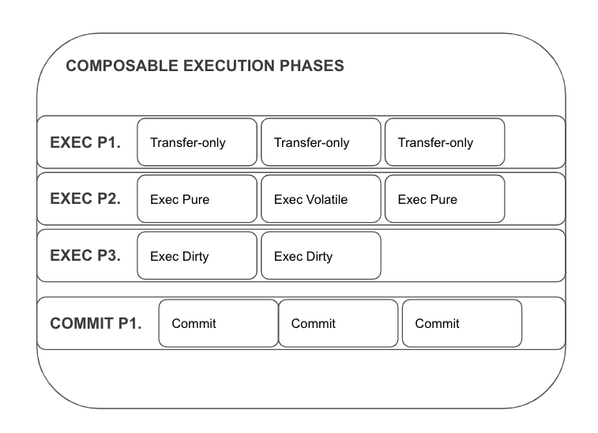

## Composability

The protocol is capable of connecting multiple executions on multiple blockchains. We provide a framework capable of making all types of interoperable transaction reversible, therefore composable into many steps of the same transaction. We see it as perhaps the most important feature of our protocol. Thanks to that, an interoperable execution can be reduced to a difficulty degree of a smart contract working within a single-chain context. 

The protocol recognises four execution types that can be ordered by requesters as a single composite on foreign chains:
#### Transfer-only Execution
Execution involving a single asset transfer fungible or non-fungible.

#### Pure Execution (Static, view-only) 
Execution of generic programs that enforces not to cause any changes to the state of programs running on extrinsic blockchains. Applicable for interoperable feature type 3. & 2. The pure execution prevents the state of other programs, native to that chain, to be modified and therefore made irreversible while executing via extrinsic gateways. 
Pure execution is useful when the composable contracts require read-only access to the resources on extrinsic blockchain. 
 
#### Dirty Execution (with side-effects, irreversible on chains with extrinsic gateways)
Execution of generic programs that causes changes to the state of programs running on extrinsic blockchains. This is the only type of execution which can be irreversible if carrying through extrinsic programmable gateways. It can still be made reversible, and therefore composable, when carried through intrinsic programmable gateways. This is because the execution is reverted (dirty execution is identical to volatile execution in this case) with intrinsic gateways but the effects recorded in the form of Execution Stamp and emitted as an event. From there, the deferred results can be applied in the commit phase via sudo access to the accounts ledger.

#### Volatile Execution (always reverted)
Execution of generic programs that always reverts its changes to the state of programs running on extrinsic blockchains. Similar to the pure execution in the sense that leaves no changes to the programs running on extrinsic blockchains, albeit still records all of the side effects. Useful for extrinsic gateways to get an insight into the results of the foreign programs execution. In other words to simulate the execution on extrinsic chains without the consequences of modifying their state.

### Execution Phases
Execution types can compose one another. For each execution order, a requester creates the Composable Execution Schedule that instructs the Circuit & Agents about the demanded order by which the composites will go together as one interoperable transaction. 

!Execution Order can group the composites within several sequential phases or parallel steps. Up upon the final "Commit" phase all of the steps are still reversible. 

\begin{itemize}
    \item Execution -- all types of execution will now be carried out by execution agents via all kinds of involved Gateways on all appointed extrinsic blockchains. Execution consists of multiple sequential phases of which all can have multiple steps. Each step must have its proof delivered by relayers and verified by the Circuit validators. The execution stamp is built up with the next successful step, and the phases can already rely and access the deferred execution results from the previous phases. This allows the execution steps to adhere their actions to the overall context of the interoperable transaction and decide whether to carry on with the execution or fail the step and start the "REVERT" phase.
    \item Revert -- Optional and the last phase, triggered when the execution fails on one of the Gateways or cannot be proved by Circuit during Execution phase. During that phase on each execution agents must revert the changes from extrinsic chains involved in execution.
    \item Commit -- Optional and the last phase, triggered after all execution phases are successfully concluded and all the steps are proven to be correctly facilitated to all extrinsic chains.
        After validators collate a composable transaction to the relay chain, parties can claim release of their resources from the escrow accounts. Relayers are incentivized to propagate the information from relay to extrinsic chains, but any actor can trigger the release. For different gateway types the COMMIT phase means different claims: 
        - transfer-only two-way gateway: validators co-signed the valid transactions to the execution stamp releasing the funds on extrinsic blockchains.
        - programmable gateways: Funds locked on escrow accounts are available for claim and are controlled by the integrated smart contract / programs. Intrinsic gateways can now release the deferred storage write & events directly to the storage of extrinsic smart contracts programs using its special sudo authority. At extrinsic gateways, execution-dirty already left the desired effects to the foreign smart contract / programs. 
    After the commit phase changes to the target accounts and on-chain smart contracts / programs can no longer be reverted. 
\end{itemize}

### Volatility
Smart Contracts usually have two phases: Deploy & Call. Deploy instantiates the new smart contract with specified data (inside the contract). Call executes that contract with specified input data. 

Recreation instantiates the smart contract the given pre-state. This will be handled in the "deploy" phase of a smart contract, but instantiate the contract from the point at the history of the state where the execution finished the last time that code was executed. The state is preserved by the circuit. In this way the circuit can always keep on track the smart contract's state history on each chain it was executed. 
###### This is an important part to the objective of composability of our solution. Execution is abstracted from data on specific chains. The execution within a context of an extrinsic chain can be reverted to any previous point in the history, as the underlying smart contract's state is not stored on the extrinsic chain but maintained by the t3rn circuit instead.
Why recreate a contract every time on an extrinsic chain instead of leaving it there? By doing so we ensure that all of the execution of that contract and modification to its state will be tracked by the Circuit. Synchronization between the state of the same contract on the circuit and extrinsic chain is problematic and introduces unnecessary complications to the protocol.  
